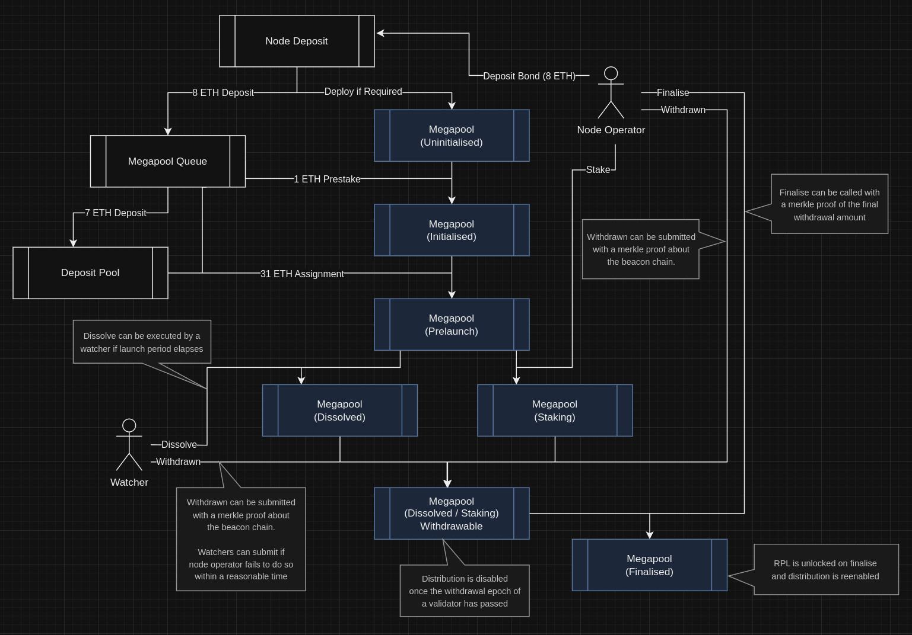

# Megapools

## Overview

A megapool is a one-per-node-operator contract which acts as the withdrawal credentials for one or many validators. The main purpose of this design is to drastically reduce the gas required when setting up more than one minipool.

The key challenge with this design is that the beaconchain does not distinguish between rewards and capital when depositing ETH into the withdrawal credentials' address. From the perspective of the smart  contract, the only thing that changes is its balance increases by some amount. E.g. if a large node operator with many minipools has 32 ETH worth of skimmed rewards appear in the withdrawal credentials address, we do not immediately know if that is one of their minipools exiting or just a partial withdraw (skim).

The reason this is an issue is that we need to treat rewards and capital differently. Rewards are shared proportionally between node operator and rETH users with a "commission" going to the node operator. However, capital needs to be returned proportionally without the commission applied.

Secondly, we also need to handle the case where a validator is slashed. In this scenario, the node operator's capital is slashed first and rETH users only if the node operator's capital is not great enough to cover the slashing.

Finally, the oDAO is not long for this world so any design choice we make here should not introduce any additional duties for them to perform. It needs to be a trustless solution.

With the introduction of beacon state root available to the EVM (EIP-4788), we now have the ability to access beacon state data on the EVM. This opens up many possibilities for the protocol. However, it isn't a silver bullet that gives us access to everything we need immediately. There are many limitation to design around. Most importantly, access to the data is essentially asynchronous.

## Technical Implementation

### Deposit

Each node operator can deploy a single "megapool". Its address is deterministic based on the node operator's address. Like minipools, its logic is determined by a delegate and has a similar opt-in-to-upgrades function. Opt-in upgrades gives node operators assurances that a malicious oDAO can't upgrade their distribution logic that results in loss of funds. The current minipool delegate has upgrades and rollbacks. Rollbacks has caused many design challenges for minimal gain and so we recommend not including a rollback mechanism for megapools.

A node operator's megapool will be automatically deployed on their first deposit to this new system. This initial one-time setup will cost about the same amount of gas as a regular minipool. However, subsequent deposits will require substantially less gas as they won't need to deploy a new contract each time. This is one of the key gas savings in this design.

Node operators can deposit to the beaconchain via the megapool multiple times, the process is very similar to how it currently is for minipools. For each deposit, the new validator's pubkey is recorded in a set maintained by the megapool that associates validators with that megapool. Each validator is issued a megapool index to uniquely identify it that is separate from the beacon chain validator index. 1 ETH is sent to the megapool during deposit and the remainder to the deposit pool. The megapool address is appended to the deposit queue to be assigned in a first-in-first-out fashion analogous to the current minipool queue. A megapool can have more than one entry in the queue waiting to be assigned ETH from rETH users.

The 1 ETH from the node operator's deposit is sent to the beacon chain deposit contract. This is the minimum deposit amount accepted by the deposit contract and if it is the first deposit for a validator, it sets the validator's withdrawal credentials.

The node operator now has to wait for two things to happen before they can continue. They need to wait for their new validator to progress through the Rocket Pool queue and be assigned the remaining 31 ETH required to spawn a new active validator. And secondly, they must wait at least `ETH1_FOLLOW_DISTANCE` (2048 blocks / ~8 hours) and up to `EPOCHS_PER_ETH1_VOTING_PERIOD` (~6.8 hours) for the new validator to appear in the validator set in the beacon state.

The existing oDAO scrub process is no longer required as we rely on state proofs against the beacon state root that will be made available with EIP-4788. However, the time it takes from deposit until the data is available in the beacon state is around the same time as the scrub period is now.

### Assignment and Staking

Once assigned ETH from the queue, the validator enters a "prelaunch" status. The node operator may then generate a merkle proof that proves there is a validator in the beacon state with a matching pubkey and correct withdrawal credentials. The proof also conveniently tells the contract what the beacon chain validator index is for this validator which is stored in the contract for use in the future proofs. Upon successful submission of the above proof, the validator enters "staking" status where it remains until the node operator is ready to exit the validator.

### Dissolution

If the node operator fails to provide the proof after 14 days, whether it be their node goes offline or they tried to exploit the system by using a pubkey of an existing validator with incorrect withdrawal credentials, then the validator can be dissolved. This results in the rETH funds being returned to the deposit pool for use by another node operator. In the absence of an oDAO duty to execute the dissolution, this function must be incentivised. The node operator who calls dissolve will be awarded a small amount of the other node operator's RPL stake (enough to cover gas in worst case and then some reward on top). This service will be implemented as an opt-in feature of the smartnode and will likely include some mechanism to prevent a gas war to claim the reward (round robbin submission gate or something of that nature). 

A dissolved validator will be marked as such in the megapool. The node operator may rescue the 1 ETH deposit by acquiring the additional ETH required for a full deposit from somewhere else and activating the validator. Then when they exit the validator, they follow the same process as below but upon finalising the capital will be returned entirely to the node operator instead of splitting it.

### Voluntary or Involuntary Exits

Whether the node operator exits their validator voluntarily via a signed voluntary exit message or their validator is forcibly exited by the Ethereum protocol for misbehaving or neglecting validator duties, the outcome is the same. Their validator will have it's `withdrawable_epoch` set to a value other than the default `FAR_FUTURE_EPOCH` (2**64 - 1). It is the responsibility of the node operator to inform the megapool of this state change via a merkle proof. The node operator will have some reasonable number of epochs (2-3 hours) to perform this duty. Failure to do so in time will result in another node operator being able to submit it for them at a cost to the misbehaving node operator's staked RPL. Enough to cover gas in worst case and then some punative amount on top. Like dissolution, this will be implemented as some opt-in feature of the smartnode that node operators can partake in. The megapool keeps track of the lowest value `withdrawable_epoch` submission it has received via this proof system.

In the future, once forced exits are made available by the Ethereum protocol, the above process is unlikely to change. Supporting forced exits (or EL initiated exits) would simply require an updated delegate which is capable of submitting the exit request.

### Distribution

Both execution layer rewards (MEV and transaction fees) and consensus layer rewards will accrue in the megapool contract. Note, execution layer rewards will still go to the smoothing pool if the node operator is opted into it. They can be distributed at any time so long as there are no validators that belong to the megapool in the "withdrawing" state. That is, there are no validators with a `withdrawable_epoch` lower than the current epoch. Once any validator enters this state, they must all be finalised before the megapool can resume normal distribution policy. This is because we need to treat the capital distribution differently to rewards and the capital will appear in the contract without notice some unknown time after `withdrawable_epoch` is reached.

This allows node operators with many validators to distribute rewards in a very gas efficient manner. They will no longer have to distribute each minipool at a time. Like the current node fee distributor, node fee and capital ratio will be averaged across all validators managed by a megapool. 

### Finalising

Once a validator has exited, there will be a corresponding `Withdrawal` entry in the `ExecutionPayload` of a recent block. The node operator (or anyone else) must submit a proof to the megapool of this entry which includes the withdrawal amount and the withdrawal epoch. There is a special case with a withdrawal where the epoch of the withdrawal is greater than or equal to the `withdrawal_epoch` of the validator. This indicates it is a final withdrawal for this validator and prevents a previous partial withdrawal from being submitted as the full withdrawal.

The megapool will take this proof and distribute the final amount to the node operator and rETH users based on the validator's collateral ratio. If there are no other validators pending exit, the megapool is now available for regular distribution once again. If there are more pending exits, distribution is still restricted.

### Diagram

The diagram below shows the state transitions and the actors involved:

