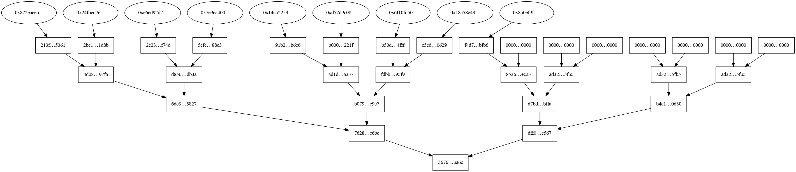

# Specification for the Rewards Merkle Tree

Rocket Pool's [Redstone](https://medium.com/rocket-pool/rocket-pool-the-merge-redstone-601d9efd6b4) update has introduced a new rewards system based on a Merkle Tree distribution system.
For each rewards interval, this tree will capture the RPL rewards (both for node operation and Oracle DAO membership) and the ETH rewards (from the Smoothing Pool, if relevant) for all of the nodes in the Rocket Pool network.

The following is a specification that formally describes the tree's construction and behavior.
Users should be able to use this specification to independently verify the tree that is produced by the Oracle DAO.


## Overall Structure

### Tree Size and Leaf Nodes

The Rewards Merkle Tree is a complete binary tree, where each node has exactly two children (with the exception of leaf nodes, which have zero).
Therefore, the total size of the tree is *always* a power of 2, minus 1.

Fundamental to each Merkle Tree is the data that is used to produce the leaf nodes of the tree.
Each Rocket Pool node will represent a single leaf node.
The value of the leaf node will be the `Keccak256` hash of the node's metadata (described further below).

If the total number of nodes is not a power of 2, all of the remaining leaf nodes will have the **null hash** (0x0000...0000) instead of the hashed node metadata to pad the total count to a power of 2.
For example, if there were 9 Rocket Pool nodes, they would each constitute a leaf node of the tree and there would be 7 supplemental "null" leaf nodes to bring the total leaf count to 16 (the next highest power of 2).


### Sorting Leaf Nodes

Prior to tree generation, all of the Rocket Pool nodes's metadata must be hashed to produce the values of the corresponding leaf nodes.
The hashes should be recorded in **big-endian format**.
This collection must then be **sorted lexicographically** by these hash values, so the leaf node with the lowest value becomes the leftmost (first) leaf node.
The leaf node with the second-lowest value must be the second leaf node, and so on.

Missing nodes filled in with null hash values (`0x0000...0000`) will be used to pad the tree **at the end of this sorted list**, not before it.
This will cause those nodes to be out of order lexicographically (as `0x0000...0000` would normally come before anything else).

For example, if there were 9 Rocket Pool nodes that generated the following leaf node values from their hashed metadata:

`0xb50d..., 0x213f..., 0xb000..., 0x2c23..., 0x2bc1..., 0x5efe..., 0xf4d7..., 0x91b2..., 0xe5ed...`

These leaf nodes would be sorted into the following order prior to generating the tree (including the null-hash padding at the end):

`0x213f..., 0x2bc1..., 0x2c23..., 0x5efe..., 0x91b2..., 0xb000..., 0xb50d..., 0xe5ed...,  0xf4d7..., 0x0000...., 0x0000...., 0x0000...., 0x0000...., 0x0000...., 0x0000...., 0x0000....`


### Branch Nodes

To find the value of the branch node, use the following procedure:

1. Get the value of the left child node (which is a `Keccak256` hash). Call this `left`.
2. Get the value of the right child node (which is a `Keccak256` hash). Call this `right`.
3. Sort these values lexicographically; that is, if `right` is lower than `left`, switch `left` and `right`.
   - NOTE: don't reorder the child nodes in the tree itself, just switch the values of the `left` and `right` local variables.
4. Concatenate the two hashes (which are both 32 bytes) into a 64-byte array where `left` represents the first 32 bytes and `right` represents the last 32 bytes.
5. Calculate the `Keccak256` hash of this 64-byte array. **This hash is the value of this branch node.**

Consider the following example:

```
left = 0xfdbbe597834a953e4c4e50fd8ae8859fd4ae6bf808eb72139ee5a4c224e695f9
right = 0xad1d32ebc492ff5ad2ab148049de34db5b6d45b9d467823470dffb4c18a4a337
```

In this case, the concatenated byte array would be `0xad1d32ebc492ff5ad2ab148049de34db5b6d45b9d467823470dffb4c18a4a337fdbbe597834a953e4c4e50fd8ae8859fd4ae6bf808eb72139ee5a4c224e695f9` (note the reordering due to the sorting here).

The `Keccak256` hash of this would be `0xb079b0168e5beba73f17c52b76a614539b242d8efcf6bb99e0dd66a2e251e9e7`, which becomes the value of this branch node.


## Leaf Node Values

Each leaf node of the tree is the `Keccak256` hash of a single Rocket Pool node's metadata.
The structure for this metadata is as follows:

`metadata = address[20] ++ network[32] ++ totalRPL[32] ++ totalETH[32]`

where `address[20]` refers to a byte array of size 20 bytes, and the `++` operator refers to byte array concatenation.

Each of these values is defined as follows:

- `address` is the standard 20-byte Ethereum address of the node wallet.
- `network` is a 256-bit (32-byte) unsigned integer representing which network the node has selected for their rewards.
  - `0` represents Mainnet.
  - More values will be added as we integrate support for various L2s to the rewards system. Currently, `0` is the only legal value for this.
- `totalRPL` is a 256-bit (32-byte) unsigned integer representing how much RPL in total the node has received for this rewards period.
  - This value is the sum of the RPL rewards provided for staking minipools and the RPL rewards provided for ODAO membership.
  - The RPL value is expected in **wei**, so rewards of `2` RPL would be represented as `2000000000000000000` (in decimal).
- `totalETH` is a 256-bit (32-byte) unsigned integer representing how much ETH the user has earned from the smoothing pool, if opted in.
  - The ETH value is expected in **wei**, so rewards of `2` ETH would be represented as `2000000000000000000` (in decimal).

In total, the metadata will be an array of **116 bytes**.

For example, say there were a node with the following values in its metadata:
- Address: `0x8B0EF9f1932A2e44c3D27bE4C70C3BC07A6A27B3`
- Network: `0`
- Total RPL: 1.5 RPL (`1500000000000000000` in wei which is `14d1120d7b160000` in hexadecimal)
- Total ETH: 2.5 ETH (`2500000000000000000` in wei which is `22b1c8c1227a0000` in hexadecimal)

This node would have the following metadata byte array (in hexadecimal):

`0x8b0ef9f1932a2e44c3d27be4c70c3bc07a6a27b3000000000000000000000000000000000000000000000000000000000000000000000000000000000000000000000000000000000000000014d1120d7b16000000000000000000000000000000000000000000000000000022b1c8c1227a0000`

Taking the `Keccak256` hash of this value will produce the **value of the corresponding leaf node** in the tree for this Rocket Pool node.


### Nodes With No Rewards

For a node to be added to the Rewards Merkle Tree, it must have either more than 0 RPL rewards or more than 0 ETH rewards.
**A node with 0 RPL rewards and 0 ETH rewards is not added to the tree. It is ignored as though it didn't exist.**


## Complete Example

To do a complete example of the tree structure, consider the following 9 Rocket Pool nodes where the RPL and ETH values are already provided as decimal strings in `wei`:

```json
"0x14cb2253a2F9898EFA43b9ca15bCFDE401CCFbe7": {
    "network": 0,
    "amountRPL": "2000000000000000000",
    "amountETH": "0"
},
"0x18A58E43c37DdC9ccCf3AC642c6f430ad663E400": {
    "network": 0,
    "amountRPL": "1333000000000000000",
    "amountETH": "300000000000000000"
},
"0x24fBeD7Ecd625D3f0FD19a6c9113DEd436172294": {
    "network": 0,
    "amountRPL": "2000000000000000000",
    "amountETH": "1000000000000000000"
},
"0x6f10Fd508321D27D8F19CBCC2F2f3d5527B637eC": {
    "network": 0,
    "amountRPL": "100000000000000000",
    "amountETH": "300000000000000000"
},
"0x7e9eA400443957BE3918acfbd1f57cF6D3f5126A": {
    "network": 0,
    "amountRPL": "1000000000000000000",
    "amountETH": "0"
},
"0x822Eaeebb9e106C8CB263bDa6455430fEC652653": {
    "network": 0,
    "amountRPL": "0",
    "amountETH": "2000000000000000000"
},
"0x8B0EF9f1932A2e44c3D27bE4C70C3BC07A6A27B3": {
    "network": 0,
    "amountRPL": "1500000000000000000",
    "amountETH": "2500000000000000000"
},
"0xD57D9c08926E28fC9F1f3dd65Db02e6a7958380c": {
    "network": 0,
    "amountRPL": "100000000000000000",
    "amountETH": "300000000000000000"
},
"0xe6ED92D26573c67AF5eca7fB2a49A807FB8f88dB": {
    "network": 0,
    "amountRPL": "1333000000000000000",
    "amountETH": "300000000000000000"
}
```

These nodes would generate the following tree according to the specification described here:

