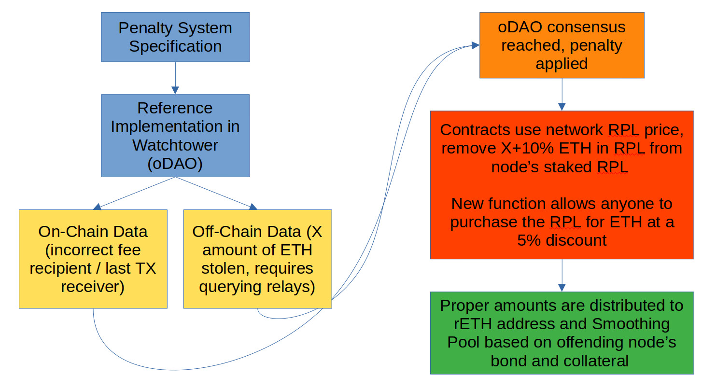

# [Draft] Proposal for a Modernized Penalty System

**NOTE: This document is still a DRAFT and is subject to change.**

---

This proposal describes a candidate for a novel penalty system for the Rocket Pool protocol that replaces the current (as of Atlas) system.
It aims to address many of the concerns in the current system and be upgradable to reduce any required permissioned / trusted components when the technical limitations requiring them have been removed.

## Drawbacks of the Current System

The current system, at a high level, works as follows:

- Each block proposal is "checked" by the Oracle DAO.
  - If the proposer is a Rocket Pool validator, check if the fee recipient.
  - If the owning node is opted *in* to the Smoothing Pool and the fee recipient is *not* the Smoothing Pool (where the last TX address can be the used as the fee recipient in the case of a MEV block), flag this proposal for cheating.
  - If the owning node is opted *out* of the Smoothing Pool:
    - If it's been < 2 epochs since they opted out, and the fee recipient is *not* the Smoothing Pool, flag this proposal for cheating.
    - If it's been >= 2 epochs since they opted out (or they never opted in at all):
      - Legal fee recipients are the **rETH** address, the **Smoothing Pool** address, or the node's **Fee Distributor** address. Anything else gets flagged for cheating.
- If enough Oracle DAO members vote to flag the block for cheating, submit a **penalty** to the proposing minipool.
- The first two penalties are called **strikes** are do not carry any action. The third penalty and beyond are called **infractions**, and each one deducts a portion of the minipool's ETH locked on the Beacon Chain after it's been withdrawn.
- This penalty is currently 10% of the bond per infraction, up to a maximum of 80%.
- The penalty amount per infraction can be controlled by the Oracle DAO and maximum amount is controlled by the Protocol Guardian.

This system has several issues that have been raised since its original inception:

1. The "three strike rule" makes it meaningless against parties that selectively cheat only when they know a large block is on the line, as they can simply exit and withdraw after the second penalty and re-stake without issue.
2. The fact that penalties are levied on minipools, and not the node, means large node operators with many minipools will be able to steal considerably more rewards than small node operators, but will still penalized at the same rate as the small node operators.
3. It gives the Oracle DAO the ability to redirect node operator ETH that's staked on the Beacon Chain, which is *intended* to be immutable, thus introducing concerns around Oracle DAO centralization and/or compromise.
4. Currently, there is no way to actually "manifest" the infractions until the node operator exits the validator and withdraws from the Beacon Chain; in other words, a node operator that cheats can continue to do so in perpetuity without feeling the ramifications of those infractions. This drags the returns for both the rETH users and the other Smoothing Pool members (if applicable).

These concerns, particularly the third, have made the Rocket Pool development team hesitant to enact the penalty system as-is.
The fact that the data to detect cheating according to the above rules remains on chain in perpetuity has given us time to reflect on and improve the system.

This proposal is the first attempt at standardizing a new penalty system based on our lessons learned and the current state of the Ethereum landscape.
It aims to be more effective, be more fair, be faster, significantly reduce existing contract complexity, and provide additional utility to the RPL token.

## The New System

Below is a brief high-level diagram depicting the various steps and components of the proposed system.

In the new proposed system, the Oracle DAO would largely follow the same rules as the old one in order to detect cheating: it would scan every block, compare the block's fee recipient and if it wasn't expected, compare the recipient of the last transaction.
If none of them are expected, the block will be flagged for cheating and once consensus is reached on flagging a proposal, action will be taken.
That much remains the same.

Everything else, including the "action to be taken", however, is now completely different.

### Flagging Cheating Blocks

The exact rules for this process will be codified into a formal specification at a later date.
We've had massive success with the open specification for the [Redstone Rewards Tree system](../Merkle%20Rewards%20System/merkle-tree-spec.md), which has lead to custom third-party implementations of the routine (and the standalone [treegen](https://github.com/rocket-pool/treegen) utility) that have collectively resulted in bugfixes and refinements to the specification itself.
We'd like to continue that approach by developing a detailed specification for "feecheck" (name pending), which could be implemented as a similar standalone tool by multiple parties to ensure correctness prior to deployment.

As an aside, we want to highlight that there are two ways someone could steal from the protocol:
1. By using an incorrect fee recipient.
2. By intentionally building a malicious block (either by themselves or by colluding with a builder / relay) that extracts MEV, gives it to an address they control, and obfuscates it with a supplemental transaction to the *correct* fee recipient for less MEV than was actually extracted.

The former is easily verifiable with on-chain data and what we will focus on in the upcoming specification.
The latter is much more difficult to detect, and its threat is why we have claimed that MEV-Boost will be required by node operators eventually.

In light of this, our first iteration of this specification will **only focus on the first vector** as a way to detect cheating.
This means that MEV-Boost we would no longer have any plans to require MEV-Boost for node operators under this system, and it will remain opt-out in perpetuity.

Regardless, as part of flagging, this system requires the following information to be presented:
- The address of the node operator being flagged
- The offending slot number on the Beacon Chain, and the corresponding Execution Layer block number
- The "expected" fee recipient, based on Smoothing Pool status
- The "actual" fee recipient
- The recipient of the last transaction in the block
- The amount of ETH stolen
  - If this was a locally-built block, it will simply be the block fee
  - If this was a MEV-Boost block, it will be obtained by querying the relay that provided it

This information is then passed onto the Rocket Pool protocol contracts.

### Staked RPL Deduction and Sale

Upon consensus of the flagging being reached by the Oracle DAO, the contracts will remove RPL from the offending node's staked RPL.
They will use the current RPL price stored within the network (as reported by the Oracle DAO every 19.2 hours) to determine the equivalent amount of RPL to the amount of ETH stolen.
They will add some amount of supplemental "theft tax" (arbitrarily set at 10%, the exact figure is left to community discussion).
This total amount will be removed.

If the node does not have sufficient RPL to cover the loss, as much as possible will be taken but no action will be taken after their RPL stake reaches zero.
In the future when it is possible, this would be a good candidate situation for a forced exit to occur.

Along with the amount of RPL, the contracts will determine the amount of ETH that was stolen from the pool stakers (rETH holders), and optionally from the Smoothing Pool (if opted in).
These figures will be determined by the bond amount and commission rate of the minipool responsible for cheating.
Once determined, they will be recorded on-chain as part of the cheating event.

After this bookkeeping, the contracts will make the RPL immediately available for sale to anyone at a slight market discount.
This will *not* use the current auction system; it will simply be a figure, in ETH, determined by the current Rocket Pool network price.

The intent is for the RPL to be sold quickly so that the rETH stakers and Smoothing Pool users can be compensated for the losses as quickly as possible, thus minimizing the impact on the rETH ratio and avoiding situations where the Smoothing Pool crosses a rewards interval while missing the stolen portion.
The 5% figure will hopefully attract arbitrage bots, much in the same way that the deposit pool has, to make this compensation almost immediate.
Despite being sold at a market discount, the 10% tax means that in total, theft of 1 ETH will result in 1.045 ETH being provided to the pool(s); thus, cheating ends up being a net *gain* for the rETH users and the Smoothing Pool, though minimal. 
(Admittedly 5% is arbitrary and is left to community discussion).

Upon purchasing the RPL, the ETH will be distributed among the rETH address and the Smoothing Pool (if applicable) accordingly.

### Impact on Other Rewards

Upon being flagged for cheating, the node would **no longer be eligible** for rewards from the Redstone Rewards system.
They would no longer receive RPL inflation, and they would no longer be eligible for the Smoothing Pool.
If they wanted to continue earning RPL or Smoothing Pool benefits, they would have to exit entirely, make a new node, and start over which would have substantial gas fee consequences.

We leave it to community discussion to determine if this is excessively punitive or justifiable.

## Pros

The following are benefits to this system:

1. It removes the old penalty system entirely, ensuring that the Oracle DAO can never touch the node's staked ETH which should help assuage concerns around its power.
2. It's fairly simple and fast to implement in the contracts, meaning it can be audited and rolled out "relatively" quickly when compared to a larger update like Redstone or Atlas.
3. It's easy to upgrade later on to reduce trust more (such as via fraud proofs, if/when they are viable based on EVM-accessible information) as the entire thing can be stored in a single contract (`rocketNetworkPenalties`) that can be swapped out.
4. It doesn't impact minipools themselves, so no delegate upgrades are required to implement it.
5. We can assert that, based on these rules, we will **never** require node operators to use MEV-Boost; it can perpetually stay as an opt-out addition, as it is today.
6. It more accurately aligns with the intent of the RPL token as supplemental and accessible collateral for protocol safety.

As an interesting side-effect, doing this would likely result in us removing the current **RPL auction system** which is very complex.
Instead, RPL slashings due to nodes exiting with less ETH than their bond can cover would simply use this new system.
Note, however, that they would be subject to the same 10% tax as the cheating penalty if this were to occur.

## Cons

The following are drawbacks to this system:

1. The fixed RPL discount (arbitrarily set to 5%) could be made more efficient if it were dynamic in nature; we chose to make it a small fixed value for the sake of simplicity.
2. As mentioned, node operators that distributed their Beacon balance after being slashed substantially would incur a 10% tax on their RPL taken.
3. Because this removes the ability to penalize the ETH bonded by node operators, it's possible that it attracts an audience of people that intentionally stake the bare minimum and are committed to cheating in the long term, expecting the APR from MEV rewards to outweigh the consequences of losing the RPL bond and supplemental RPL rewards. Without forced exits, there currently isn't any recourse that prevents this kind of user. Doing this would require making RPL rewards greater than expected MEV rewards to dissuade bad actors.
4. It's possible that MEV theft will be rare or occur for very small amounts of ETH; in this situation, the gas cost required to purchase the discounted RPL will outweigh the discount itself which means the backpay system wouldn't work as intended. An alternative, such as aggregating stolen RPL and making it available in bulk once it becomes cost effective to purchase, may be required.

## Discussion

The development team is in favor of this simplified system and the culling of old code that it brings, though it still has some challenges that need to be fleshed out.
We are eager to engage with our community in order to refine, adjust, and otherwise evolve the penalty system into one more suitable for the current Rocket Pool network.
