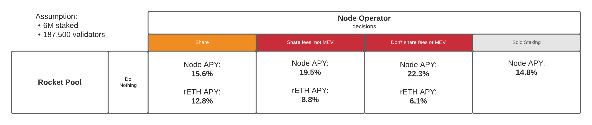

# Decision Analysis

## Problem

To remain competitive with centralised liquid staking tokens, rETH must capture priority fees and potentially Maximal Extractable Value (MEV). Centralised staking pools who own and operate their nodes are technically able to funnel this value into their liquid staking token, increasing their growth rate and making it more attractive. Decentralised staking pools relying on individual node operators need a crypto-economic mechanism to incentivise node operators to not act selfishly.

We do not expect everyone to engage in MEV extraction but the mechanism we design would have to be compelling if they did. Coinbase change detection is relatively easy but there are open questions about how MEV can be detected (see MEV research / collaboration).

**Question**: Can we implement a crypto-economic mechanism that makes not sharing priority fees or MEV economically irrational for most node operators?

## Scenarios

There are four scenarios that we will model to answer this question:

**Scenario 1: Share** - The ideal situation is that node operators share their priority fees and MEV with the pool. This scenario covers the honest node operator case and is used in comparison with the dishonest cases to show what the rational decision would be.

**Scenario 2: Share fees, not MEV** - This scenario describes when a node operator shares their fees (via coinbase) but does not share MEV rewards with the pool.

**Scenario 3: Don't share fees or MEV** - This scenario describes when a node operator does not share their priority fees or their MEV rewards with the pool.

**Scenario 4: Solo staking** - As a reference point we will include solo staking outside of Rocket Pool.

## Do Nothing

One option is for Rocket Pool to do nothing. Clearly the rational choice for node operators is to not share fees or MEV.



## Apply Penalties

To counter-act this natural incentive, the Rocket Pool protocol would need apply a penalty if node operators do not share fees or MEV (if possible).

With this option, a dishonest node operator would experience, at least, **11 years** of reduced returns.


## Incentives

We are researching a number of incentives to further support node operators' choice to share fees and MEV with the rETH pool.

Unfortunately incentives alone are not enough to provoke the choice; we have currently not found an incentive that is both capital efficient and can fully overcome the natural incentive. 

## Future

As ETH2 participation increases the returns from penalty fees and MEV reduce so the penalty effect increases.

+ At **7M** total ETH staked, a dishonest node operator would experience, at least, **13 years** of reduced returns.
+ At **8M** total ETH staked, a dishonest node operator would experience, at least, **15 years** of reduced returns.

## Full Analysis

Here is a spreadsheet of the full analysis: [FeeMEVAnalysis.xlsx](FeeMEVAnalysis.xlsx)

## References

We use [Justin Drake's spreadsheet](https://docs.google.com/spreadsheets/d/1FslqTnECKvi7_l4x6lbyRhNtzW9f6CVEzwDf04zprfA/) for ETH2 issuance numbers. We also used it to calculate the estimated priority fees but we adjusted the assumed gas price to 20 gwei. 

Our justification:

+ the all time median is 22.8 gwei
+ over the last year the median has been 85 gwei
+ if the gas price remains that high going forward then layer 2 has failed and Ethereum is in trouble
+ based on our research even if the gas price is higher we still have headroom to absorb

We use [Flashbot's research paper](https://hackmd.io/@flashbots/mev-in-eth2) and associated Jupiter Notebook for MEV estimates and average ETH2 proposals.

We used the Flashbot's approach for calculating the number of ETH2 proposals given the number of validators (187500 in below):

```
Python 3.8.5 (default, May 27 2021, 13:30:53) 
[GCC 9.3.0] on linux
Type "help", "copyright", "credits" or "license" for more information.
>>> from scipy.stats import binom
>>> binom.ppf(0.01,31556952/12, 1/187500)
6.0
>>> binom.ppf(0.99,31556952/12, 1/187500)
23.0
>>> 
```
