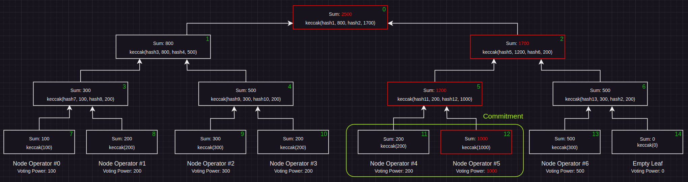

# pDAO Replacement Research

The pDAO has two primary roles within Rocket Pool. The first is having control over certain parameters which define how
the protocol operates. e.g. Enabling or disabling deposits or setting the rate of inflation. The second role is spending
treasury funds; A portion of RPL inflation is sent to a contract which the pDAO has the power to spend.

Currently, the core team is responsible for executing pDAO duties at the behest of the community governance process. For
example, the team carries out the monthly IMC and GMC payments as per the governance voted payment schedules. The plan
was for this power to reside with the team temporarily until a new power structure is set up to take over these
responsibilities. In consultation with the community it has been highlighted as a priority to accelerate this plan into
fruition.

## Overview of On-Chain Voting

The most straight forward solution is to replicate the existing Snapshot governance system (which is an off-chain vote)
but bring it on-chain. So we have the same process as we do now, just with the execution middleman removed. There are
some technical challenges to achieve this as we use a non-standard voting system.

The most common voting system for DAOs is 1 token = 1 vote. The user's token balance is their voting power and quorum is
simply some percentage of the total supply. Rocket Pool has a different approach; governance power belongs to node
operators who are the most invested in the protocol's health.

Voting power is, instead, a function of "effective RPL stake" which requires a node operator to be running validators
for the proposal to have a say in governance. The calculation is as follows:

$$
POWER = \frac{\sqrt{RPL_{effective}}}{2}
$$

$$
RPL_{effective} = \begin{cases}
0 & RPL_{staked} < RPL_{min} \\
min(RPL_{staked}, RPL_{max}) & RPL_{staked} \geq RPL_{min} \\
\end{cases}
$$

$$
RPL_{min} = \frac{ETH_{node} \times 10 \\%}{RPL_{price}}
$$

$$
RPL_{max} = \frac{ETH_{user} \times 150 \\%}{RPL_{price}}
$$

Where $RPL_{staked}$ is RPL staked by a node operator. $ETH_{node}$ is the amount of ETH a node operator has
contributed. $ETH_{user}$ is the amount of ETH a node operator has taken from the deposit pool. And $RPL_{price}$ is the
current market rate of RPL in
ETH.

NOTE: There is current discussion to remove the `sqrt` from the voting power calculation to make it linear. This will
not have any major effect on the technical implementation.

In order to support on chain proposals, the protocol will need to be able to answer the question "what was a user's
voting power at block X". Where block X is an arbitrary block that a proposal was submitted. This is achieved by other
protocols and the popular Open Zeppelin implementation by "snapshotting" any changes to users' token balance. Then when
calculating voting power, a binary lookup can be performed to determine the voting power at the proposal block.

For Rocket Pool to support snapshotted on-chain calculation of voting power with the above described voting power
calculations, we would need to keep track of all changes to $RPL_{staked}$, $ETH_{node}$, $ETH_{user}$,
and $RPL_{price}$. This is certainly possible, these change relatively infrequently. And implementing snapshotting in a
similar way as OpenZeppelin or Compound would be trivial. Unfortunately, we do run into a challenge with this approach.
Although we can calculate individual voting power this way, we also need the sum of voting power in order to calculate
quorum.

Calculating the sum of voting power on chain is not possible due to gas constraints of the loop required. We previously
encountered this problem with the old on-chain RPL reward system. It was worked around in a less than ideal way.
Whenever a node operator's $RPL_{stake}$ changed, we updated the total as well. This part is fine. But when
$RPL_{price}$ changes, it possibly changes every single node operator's $RPL_{stake}$ in a non-continuous way. This is
where looping is not possible. So we had the oDAO submit the total effective RPL stake alongside changes to
$RPL_{price}$. The downside to this method is it requires a trusted party to calculate the value off chain and submit
it.

Fortunately, there is a better way to handle this as we don't need to keep an up-to-date value for total RPL stake in
real time. We only need to know that value on blocks which have a proposal. So to get around this issue we can have the
proposer submit the total alongside a proposal. This total would come in the form of a merkle sum tree commitment.
We can then optimistically accept this value and calculate the desired quorum. We then utilise a fraud-proof system to
abolish any invalid proposal submissions. This works well for proposals as, by design, there is a long period between
submission and execution. Proposals would require an RPL bond to make, and in the event of fraud, that bond would be
paid to the verifier who submits a fraud proof.

### Delegated Voting Power

Delegates are an important part of a governance system. With voting costing the user ETH for gas, delegating is a way
for users to consolidate their power into an entity they trust and allow their voting power to go to use where it may
be cost prohibitive to be involved directly.

Unfortunately, delegating power is, again, made difficult by the inability to sum over a set of node's effective RPL
stake on chain. In this case, the set of nodes would be the ones who have delegated power to the delegate. With an
extension to the above design, we can support delegated power. The merkle sum tree commitment would be extended with
information about delegates. Instead of the leaves being node operators' voting power, it would be the root of another
merkle sum tree of all the nodes delegates to them. Or in the case of no delegation, their own node would be the only
leaf with a non-zero value. An example of this is shown in the detailed section below.

### Overruling Delegate

If a delegate votes in a direction that is opposed to a delegator's wishes, the delegator may want to move their voting
power for that particular proposal to the opposing side. Overruling is possible to implement in this design with a minor
addition. As we have all the information on chain about the delegation state and the direction a delegate votes, we can
allow a delegator to vote against their delegate AFTER the delegate has voted. It's not possible to allow them to
preemptively vote as we can't iterate over a delegate's delegators when they vote to determine the correct remaining
voting power to apply. This leads to a situation where a delegate could wait until there is very little time left to
vote before placing their vote which gives their delegator no time to react. For this reason, we would need to
split the voting period into 2 windows. Delegates must vote within the first period, then delegators would have the
second period to react if desired.

### Advantages

#### No Changes to the Existing System

The current design was the result of a lengthy community-driven design process, and expectations have been set based on
this model. Retaining the existing design has the least impact on the token and overall stakeholder expectations.
Therefore, maintaining status quo should be given priority.

#### Voting Power Interest Alignment

Most DAOs have a simple voting system based purely on token balance. Rocket Pool has a unique governance design which
gives power to the actors that are most strongly aligned with the protocol's health and longevity in mind. Token
speculators might not always have the protocol's long-term best interests at heart. Keeping voting power in the hands
of the node operators makes governance capture much more difficult.

### Disadvantages

#### Extra Gas

Additional gas is required to keep track of the various inputs to the voting power function. This would add additional
gas costs to any function that changes any of those values: staking RPL, unstaking RPL, creating a minipool, finalising
a minipool, and changing voting delegate.

#### Complexity

Unlike other DAOs, special tooling would be required to submit proposals and cast delegate votes. We would build these
tools and make them available as open source software, but it does mean any existing governance tools would be
incompatible.

## Treasury Management

In the current setup, the team spends treasury funds based on the will of our Snapshot governance system. At present,
there are two main recurring payments processed each reward period. One to the Incentive Management Committee (IMC) and
one to the Grant Management Committee (GMC).

A drop in on-chain replacement would allow for proposals to execute the treasury spend function in order to make
payments. However, voting on this spend each month for on-going payments such as to the IMC and GMC would be wasteful in
gas and time. Two possible solutions to this are: (a) hardcode the payments to the IMC and GMC into the rewards contract
or (b) develop a module that allows the governor to set up recurring payments that only require votes for setting up,
changing, or cancelling.

The main issue with hard coding is that it requires reliance on the oDAO to make changes. The amounts could be pDAO
controllable parameters, but adding new recurring payments would require contract upgrades which are in the domain of
the oDAO.

Our recommended direction is to implement a treasury contract that can handle on-going and one off payments. The pDAO
would have full control over adding, modifying, removing, etc. any payments and on-going payments can go through without
requiring an on-chain proposal each time.

## Security Council

Many of the parameters that are delegated to the pDAO are security focused. The ability to enable/disable certain
aspects of the protocol to prevent on-going damage in case of an adverse event. Being able to quickly act in these
situations is valuable to minimise the impact of such an event. It would not be desirable for the pDAO to have to wait a
week to disable a feature and so we suggest a "Security Council" be formed to handle this problem.

The security council would be a multisig with a number of known trusted individuals. Likely some of the team and rocket
scientists but ultimately up to the pDAO to decide. They would be given a limited scope of parameters which can be set
by some threshold of signatures. The exact number is up for discussion but there is a trade off in trust and response
times. Any change made would be temporary, lasting only 2 weeks (or some other length). During that period, the pDAO
would be responsible for ratifying the change to make it permanent or vetoing it to revert the change.

The pDAO would hold supreme power over the security council and would be able to add/remove members.

# Technical Information

## Submitting a Proposal

To submit a new proposal, the proposer would need to generate a deterministic state tree which represents the voting
power state of Rocket Pool at a recent block. Because it may take some time to generate and submit, the protocol will
accept a state from `MAX_STATE_AGE` blocks in the past.

The process to generate this tree is as follows:

1. Get the current execution block number. All subsequent queries should include this block number.
2. Query the number of node operators in Rocket Pool. (Note: Rocket Pool will feature a snapshot system that will allow
   users to retrieve this value, and all the other relevant values, at any arbitrary previous block)
3. Iterate over that count and retrieve each node operator's voting power at that block.
4. Pad the set of validators out to the closest power of 2 with zero values.
5. Iterate over the set generating a merkle sum tree where the leaves are `keccak(votingPower)` and the parents are
   of the form `keccak(hashA ++ sumA ++ hashB ++ sumB)`. Each node consists of a sum and a hash.
6. Take the nodes at depth `COMMITMENT_DEPTH` (this will consist of `2^COMMITMENT_DEPTH` elements). This is the
   commitment that is submitted alongside a new proposal.
7. The proposal contract will take the commitment and rebuild the tree back to the root node. The root node is stored
   on chain with the proposal details. Note: the commitment is not stored on the EVM but is accessible via calldata or
   an event. An RPL or ETH bond is paid with the proposal which is returned if the proposal is valid.

A tree with 5 node operators and a `COMMITMENT_DEPTH` of 2 would look something like this:

## Submitting a Fraud Proof

Node operators who wish to act as verifiers will monitor for new proposals. Once a proposal is raised, the following
procedure is carried out to verify the proposal is valid.

1. Generate the same tree as in `Submitting a Proposal` at the proposal's block. If the root matches, exit.
2. Iterate over the nodes at depth `COMMITMENT_DEPTH` and compare to the commitment submitted by the proposer.
3. One or more nodes will not match. Submit a challenge to the challenge smart contract indicating which node is being
   challenged. The challenge will include an RPL or ETH bond that will be paid out to the challenge winner.
4. The proposer will then have `CHALLENGE_ROUND_BLOCKS` blocks to respond to the challenge with a new commitment. This
   commitment will be `COMMITMENT_DEPTH` more layers deep where the root of the commitment equals the root of the
   challenged node. Along with this, the proposer submits a regular merkle proof back to the proposal root.
5. This process continues until the max depth of the tree is hit. At this point the smart contract can verify on chain
   the values of the leaves at the challenged index and either award the verifier and delete the proposal. Or award the
   proposer and keep the proposal alive.

### Example

Let's say node operator #5 in the above tree attempted to cheat by setting his voting power to 1000 in the tree. The
tree would look something like this:

The fraud proof process would proceed as follows:

1. A verifier computes the same tree and detects that the root is not the same.
2. After comparing the commitment values they determine that the 3rd element doesn't match and submits a challenge with
   and index of 2.
3. The proposer now has `CHALLENGE_ROUND_BLOCKS` to submit a new commitment for the challenged node:

In the case of fraud, the proposer will be unable to submit the next commitment. Because the smart contract can verify
on chain the actual values contained in the leaf nodes. If the proposer tries to submit a commitment with leaf nodes
that are not valid, it will revert. After `CHALLENGE_ROUND_BLOCKS`, the verifier can accept the reward and destroy the
proposal.

If the fraud proof was invalid, the proposer could submit a valid commitment and defeat the challenge. The commitment
would include some number of leaf nodes that are verified on chain as well as a standard merkle proof back to the
original commitment's root for the challenged node (this is required because only the top level root node is ever
stored on the EVM to save on gas). Once the final round occurs and the leaves are verified, the challenge is defeated
and the proposer is awarded the bond.

## Delegate Extension

In order to support delegation of voting power, the merkle tree commitment submitted with a proposal is extended so that
the leaf nodes are merkle sum roots of another tree wherein the leaves are every node operator in the set again but now
with the value being 0 if they have not delegated to this node operator and their voting power if they have delegated to
this node operator.

Here is an example of the same tree above, where node operator #0 has delegated to node operator #3:

The fraud proof process is similar, but now the tree is twice as deep, so it requires double the amount of rounds to get
down to the final leaf node that can be verified on chain by checking the node's voting power and whether they are
delegated to the intermediate node or not. Note: by default, nodes will be delegated to themselves.

The voting process becomes more complicated. Instead of simply voting and the contracts being able to calculate voting
power on chain, the voter must construct the same tree and provide a merkle proof down to the first leaf node that
contains their total delegated voting power.