# [DRAFT] Protocol DAO Proposal Challenge System Specification

This specification describes the terminology, behavior, and design details of the Rocket Pool on-chain Protocol DAO proposal challenge process.


## Rocket Pool Protocol Definitions

This section formally describes concepts that are used in the context of the Rocket Pool protocol and its smart contract functionality.


### Block Number

Rocket Pool protocol DAO proposals are centered around the notion of a specific **block number**. Many proposal and voting functions require this as an argument.
The block number is the specific number of a block on the Execution layer that corresponds to the state used to create the proposal.
Any supplemental operations related to that proposal, such as challenging, must use the same corresponding block number when accessing the state of the chain or transacting on the proposal for any reason (e.g., getting node information using `eth_call` routines). Note that this is *not* the block number provided as an option in the `eth_call` parameters, but is rather an argument specifically passed to certain Rocket Pool contract functions that require it.

In the context of the protocol DAO proposal system, the block number can be any block with the following caveats:
- It is *strongly recommended* that the block be **finalized** on the Beacon Chain at the time of proposal submission. This isn't currently verifiable on the Execution layer, but choosing a block that hasn't been finalized yet could potentially cause invalid proposals due to poorly-timed reorgs and the loss of the proposer's locked RPL bond.
- The block must not be older than a specific window, usually set somewhere between 30 minutes to an hour prior to the time of the proposal (to give some margin in case the network is having difficulty finalizing). The exact window is controlled by the `proposal.max.block.age` setting in the `rocketDAOProtocolSettingsProposals` contract.


### Rocket Pool Nodes

A Rocket Pool **node** is an entity that has been formally registered with the Rocket Pool network (i.e., it has called the `rocketNodeManager.registerNode(...)` function).
Nodes are identified with two unique values:
1. An **index** (`uint256`)
2. An **address** (typical 20-byte Ethereum account address), which corresponds to the sender that called `registerNode()`.

Rocket Pool nodes are typically referred to by their address, but occasionally in this document, they will also be referred to by their index. To get the address of the node at index `i`, use the `rocketNodeManager.getNodeAt(i)` function.

Note that all Rocket Pool contract functions refer to a node by its address, so there is no corresponding view to get the index of a node by its address. However, if using `rocketNodeManager.getNodeAddresses(offset, limit)`, the address at index `j` in the resulting array corresponds to the node with index `i + offset`. 

Once registered with the network, a node can never be destroyed. It will always exist and both its index and address will remain constant.


### Delegation

The Rocket Pool protocol DAO allows nodes to "delegate" their voting power to another node, which allows that other node to vote on their behalf. Nodes **cannot** be "undelegated". Every node has a delegate. That being said, by default, a node's delegate is *its own address* which means it is solely responsible for assigning its own voting power during a vote.

A node's delegate is determined by the following function:

```go
delegateAddress := rocketNetworkVoting.getDelegate(nodeAddress, blockNumber)
```

where `nodeAddress` is the address of the node in question, `blockNumber` is the number of the Execution layer block whose state you want to query, and the resulting `delegateAddress` is the address of the node this node delegated its voting power to as of the provided block.


### Voting Power

Voting Power is a unitless quantity used to signify how much "power" a particular Rocket Pool node has relative to other nodes. When that node votes on a proposal, the node's voting power is assigned to the choice in the vote.

There are two flavors of voting power:

1. **Local voting power** - the raw amount of voting power the node itself has based on its effective RPL stake, This quantity ignores the node's voting delegation choice.
2. **Delegated voting power** - the aggregated amount of local voting power across all of the nodes in the Rocket Pool network that have delegated their voting power to this node.

To get a node's local voting power, use the following function:

```go
localVP := rocketNetworkVoting.getVotingPower(nodeAddress, blockNumber)
```

where `nodeAddress` is the address of the node in question, `blockNumber` is the number of the Execution layer block whose state you want to query, and the resulting `localVP` is the total amount of local voting power this node had as of the provided block.

*Note this quantity will be provided in Wei (a fixed-point 18-decimal integer). It's important to keep it in integer-format during actual arithmetic to mitigate floating-point rounding errors during intermediate calculations. To translate it to a human-readable quantity for display purposes, divide it by 10^18 and treat the result as a floating-point number.*

A node's *delegated* voting power is not stored on-chain. It has to be derived off-chain by iterating over each node in the Rocket Pool network, keeping track of which nodes delegated to the node in question, calling `getVotingPower(...)` for each of those, and summing them all to arrive at the total.

Delegated voting power is calculated as a sum of the local voting power of the node's **direct delegates**; it does not support "chaining". More formally, in a situation where node `X` has delegated to node `Y`, and node `Y` has itself delegated to node `Z`: node `Z`'s delegated voting power will include node `Y`'s, but it will *not* include node `X`'s. The voting power is not calculated by recursively traversing delegate assignments.


## Merkle Summation Tree Definitions

This section formally defines terms and concepts related to Merkle summation trees, as the Rocket Pool protocol DAO voting process uses them extensively as part of its on-chain verification process.


### Tree

A Merkle summation tree is a **binary tree** composed of individual tree nodes (which are further described below) and parent-child relationships between those nodes.


### Node

A tree **node** is a single entity that exists within the tree. Tree nodes are *not* related to the previously defined Rocket Pool node concept, despite the common naming. In the context of a Merkle summation tree, a node can fall into one of three categories:

1. The **root** node, which is the single node at the top of the tree. With respect to Rocket Pool's usage, the root node will *always* have exactly two children.
2. **Intermediate** nodes, which are below the root but not at the bottom of the tree. With respect to Rocket Pool's usage, intermediate nodes *always* have exactly two children.
3. **Leaf** nodes, which are at the bottom of the tree. Each leaf node will *always* have exactly zero children.
 
The contents of a node (and how they are calculated) is defined by the type of node.

For **root and intermediate nodes** the contents are:
1. A **left child**, pointing to the left child node **(not serialized)**.
2. A **right child**, pointing to the right child node **(not serialized)**.
3. A **sum**, which is an unsigned 256-bit (32-byte) big-endian integer value. It is calculated as:
    ```go
    node.sum = leftChild.sum + rightChild.sum
    ```
4. A **hash**, which is a 32-byte `keccak256` hash value. It is calculated as:
    ```go
    node.hash = keccak256(leftChild.hash ++ leftChild.sum ++ rightChild.hash ++ rightChild.sum)
    ```
    where the `++` operator represents concatenation of byte arrays. As all four arguments will be arrays of 32 bytes, the total being put into the `keccak256` function will be an array of 128 bytes.

For **leaf nodes** the contents are:
1. A **sum**, which is an unsigned 256-bit (32-byte) big-endian integer value.
   - NOTE: `sum`'s exact value is context-specific and will be defined in the context of each tree in the voting protocol below.
2. A **hash** which is a 32-byte `keccak256` hash value. It is calculated as:
    ```go
    node.hash = keccak256(node.sum)
    ```


### Level

A **level** within the Merkle summation tree, refers to a row of nodes (that is, all nodes at some depth `d`; in other words, all nodes that have exactly `d` parents above them in the tree.)

Levels are **0-indexed**, so the first level is Level 0.


### Index

Each tree node is assigned an **index**, which is a positive integer value uniquely identifying that node. Indices are assigned in a breadth-first fashion, counting from left-to-right first, then top-to-bottom second.

**Tree indices are 1-indexed**, not 0-indexed. The index of the root node is 1.


## Rocket Pool Voting Trees

In the protocol DAO proposal verification system, Rocket Pool employs **two types** of Merkle summation trees: **node** voting trees, and **network** voting trees. Both of them are structurally identical; the only difference is in the definition of the `sum` property for their leaf nodes.

Both types of trees share the following properties:
- A leaf node's level-specific index in the tree corresponds to the index of a Rocket Pool node. That leaf node represents the Rocket Pool node with the same index. For example: the first leaf node (the left-most node in the tree at the bottom row) corresponds to Rocket Pool node 0. The fifth leaf node corresponds to Rocket Pool node 4, and so on.
- The trees are *complete*, in the sense that the leaf row contains a number of tree nodes that is a power of two. If there are not a power-of-two number of Rocket Pool nodes in the network, the tree is *padded* with empty nodes to make the total number a power of two.
  - For example, if there were 13 Rocket Pool nodes, the next highest power of two is 16 so the first 13 leaf nodes in the tree would correspond to Rocket Pool nodes 0-12, and the tree would have three additional "padding" leaf nodes with "empty" data (defined later) which do not correspond to Rocket Pool nodes but are just there to complete the tree.
  - Thus, for both types of trees, the total number of nodes is *always* a power of two, minus one.


### Node Voting Tree

A **node voting tree** is a Merkle summation tree representing the *delegated* voting power of a single Rocket Pool node, called the `targetNode`. For a given `blockNumber`, there will be one of these trees for *each* Rocket Pool node in the network.

The `sum` of a leaf node is calculated as follows:
1. Get the 0-based, level-specific `leafIndex` of the leaf node (for example, `0` being the `leafIndex` of the left-most leaf node).
2. Get the address `nodeAddress` of the Rocket Pool node with this index:
   ```go
   nodeAddress := rocketNodeManager.getNodeAt(leafIndex)
   ```
3. Get the address `delegateAddress` of the Rocket Pool node's delegate:
   ```go
   delegateAddress := rocketNetworkVoting.getDelegate(nodeAddress, blockNumber)
   ```
4. If `delegateAddress` matches the address of `targetNode`:
   1. Get the node's local voting power `localVP`:
      ```go
      localVP := rocketNetworkVoting.getVotingPower(nodeAddress, blockNumber)
      ```
   2. Construct a new leaf node at index `leafIndex` with `node.sum = localVP`.
5. If `delegateAddress` does not match the address of `targetNode`:
   1. Construct a new leaf node at index `leafIndex` with `node.sum = 0`.


### Network Voting Tree

A **network voting tree** is a Merkle summation tree representing the *delegated* voting power of the entire Rocket Pool network. For a given `blockNumber`, there will be exactly one of these trees total.

The `sum` of a leaf node is calculated as follows:
1. Get the 0-based, level-specific `leafIndex` of the leaf node (for example, `0` being the `leafIndex` of the left-most leaf node).
2. Get the address `nodeAddress` of the Rocket Pool node with this index:
   ```go
   nodeAddress := rocketNodeManager.getNodeAt(leafIndex)
   ```
3. Determine the Rocket Pool node's *delegated* voting power `delegatedVP` (for example, by creating a node voting tree using the above rules with `nodeAddress` as the `targetNode` and providing the final `sum` value of the root node).
4. Construct a new leaf node at index `leafIndex` with `node.sum = delegatedVP`.


## Exemplary Setup

When walking through the process of proposing and verifying a proposal, it will greatly help to have a consistent Rocket Pool network setup we can use to explore various situations. The scenario here defines **13** nodes that make up an entire exemplary Rocket Pool network, along with their total voting power and delegate assignment choices:

| Node ID | Local Voting Power | Delegate |
| ------- | ------------------ | -------- |
| 0       | 385                | 5        |
| 1       | 294                | 1        |
| 2       | 849                | 9        |
| 3       | 618                | 9        |
| 4       | 294                | 4        |
| 5       | 0                  | 11       |
| 6       | 591                | 9        |
| 7       | 430                | 9        |
| 8       | 544                | 4        |
| 9       | 10                 | 9        |
| 10      | 544                | 5        |
| 11      | 903                | 11       |
| 12      | 108                | 5        |

*NOTE: Noramlly the local voting power per node will be a considerably larger number (i.e., something on the order of 10^18) but it's kept purposefully small here just for simplicity in this example.*

The following notes are useful to observe when exploring this example:

- Nodes 1, 4, 9, and 11 have all delegated to themselves so they are responsible for voting on behalf of their constituents. The other nodes have each delegated to one of these.
- Node 8 has some local voting power, and it has delegated to node 4 which also has local voting power. To calculate their powers:
  - Node 8's local power is `544` and its delegated power is `0` (as no one has delegated to it).
  - Node 4's local power is `294` and its delegated power is `(294) + (544) = 838` where each node's voting power is represented by a set of parentheses, and the node itself's voting power is first in the list.
- Nodes 0, 10, and 12 are delegated to node 5. This makes node 5's delegated voting power `(0) + (385) + (544) + (108) = 1037`.
  - Node 5 itself is delegating to node 11. However, because delegated voting power does not follow a chain of delegates recursively, node 11's delegated voting power is only `(903) + (0) = 903`, **not** `(903) + (1037) = 1940`.
  - In other words, the voting power delegated to node 5 **does not** carry over to node 11; only the **local** voting power of node 11's *direct delegates* is applied to its delegated voting power. 
- Node 9 has several constituents deligating to it (nodes 2, 3, 6, 7, and itself). Its delegated voting power will be `(10) + (849) + (618) + (591) + (430) = 2498`.


To demonstrate the concepts thus far visually, below is a diagram representing the **node voting tree** for Rocket Pool node 9:

<center>

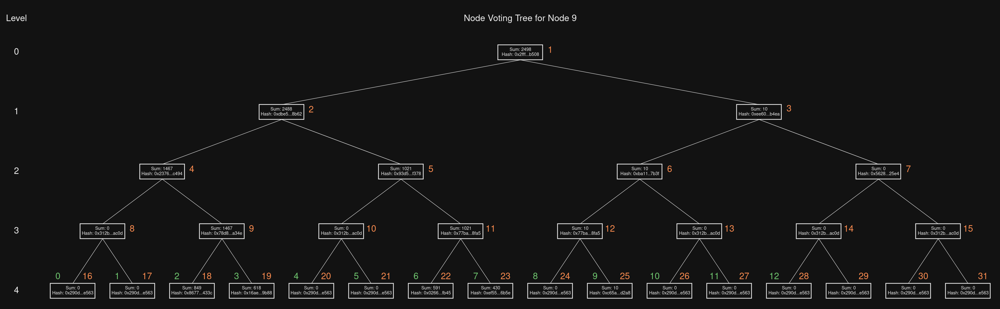

*Figure 1: Exemplary node voting tree for Rocket Pool node 9.*
</center>

where:
- The white numbers to the left of the image indicate each vertical **level** in the tree. Note that the number of tree nodes in each level equals `2^level`. 
- The orange numbers to the right of each tree node indicate the **tree index** of the tree node. As this quantity is 1-indexed, the root node has index 1.
- The green numbers to the left of each leaf node indicate the **node index** of the corresponding Rocket Pool node that is represented by that tree node. In our example, there are 13 Rocket Pool nodes so the first 13 leaf nodes correspond to each one sequentially; the remaining 3 leaf nodes at the end of level 4 are empty and used as padding. They do not correspond to Rocket Pool nodes.

Here is a diagram representing the **network voting tree** for this example setup:

<center>

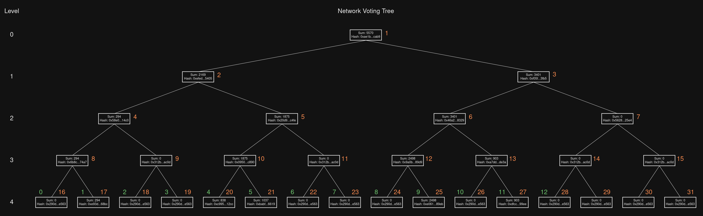

*Figure 2: Exemplary network voting tree.*
</center>

Similar to the node voting tree, each leaf node here corresponds to the same Rocket Pool node.

Observe that the root node for Rocket Pool node 9's voting tree shown above had a sum of `2498`, which is the same as the sum of tree node 25 in the network voting tree here (where tree node 25 is the leaf node that corresponds to Rocket Pool node 9).  

Also note that in some cases (such as with Rocket Pool node 2 / tree node 18) the leaf node has a sum of 0 even though the node has some local voting power; this is because the node does not have any *delegated* voting power (i.e., none of the Rocket Pool nodes in the network have delegated to it), and delegated voting power is what determines the value of the leaf node sums in the network voting tree.


## Virtual Indices

Occasionally, the Rocket Pool protocol will rely upon a tree or a subtree (see the Pollards section below) in which the root node's tree index has been reassigned; rather than starting at index 1, the root node will start at something else. The rest of the tree behaves normally with respect to the rules above; only the root node's index will change. This index is called a **virtual index**. Below is the graph for Rocket Pool node 9's node voting tree, but this time showing the *virtual* indices that will be used during actual operations:

<center>

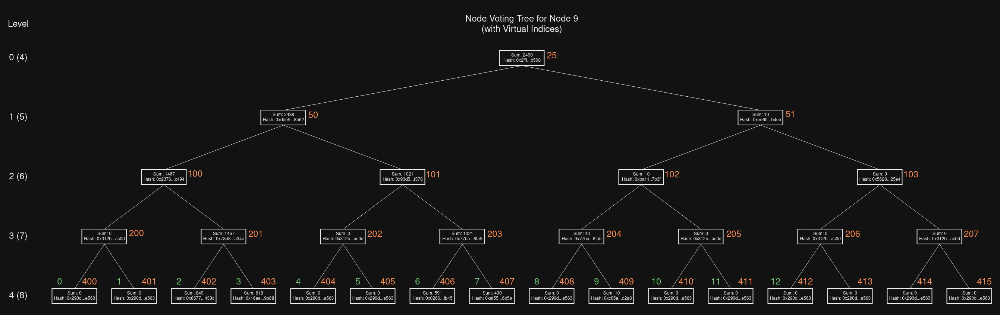

*Figure 3: Node voting tree for Rocket Pool node 9, showing virtual indices instead of logical ones.*
</center>


Here each tree index, written in orange, has been replaced by its corresponding *virtual* index. The root node starts at index 25 instead of index 1, as 25 is the index corresponding to that node in the network voting tree. If we were looking at the node voting tree for Rocket Pool node 3, the root node would have virtual index 19.

*While in theory this can all be achieved by making a single monolithic tree with the "top half" being the network voting tree and the "bottom half" being the node voting tree for each node, in practice the size of such a tree is infeasible to use on modern systems. It's much more efficient to break the composition into these two trees, as node voting trees will only need to be generated for a single Rocket Pool node to demonstrate an illegal state during a proposal challenge rather than constructing a full node voting power tree for every Rocket Pool node on the network.*

The level labels show both the "logical" level (starting at 0) and the "virtual" level (starting at whichever virtual level is assigned to the root node upon tree creation).

To *recursively* identify virtual indices of a tree node:
- The current node's virtual index is `n`.
- The left child's virtual index is `2n`.
- The right child's virtual index is `2n+1`.

To *iteratively* identify the virtual indices of a tree node:
- The root node's virtual index is `n`.
- The target node's logical level is `l`.
- The target node's position in the tree row (its offset in that row) is `o`, 0-indexed.
- The target node's index is `n * 2^l + o`.


## Pollards

A feature leveraged extensively by the protocol is the generation and distribution of **pollards**. A pollard is essentially the leaf row of a *subtree* within a graph. Subtrees are identified by two things:
- A root node
- A depth (levels to capture, 0-indexed)

For example, if we wanted to generate the pollard of the network voting tree with depth 2 and root node 3, the resulting subtree would be highlighted below:

<center>

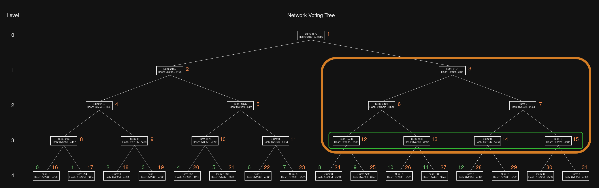

*Figure 4: Exemplary subtree and pollard selection.*
</center>

Here the subtree is highlighted with the orange box, starting with tree node 3 as its root. The row of "leaf nodes" (the smallest in the subtree) is at level 3, and the subtree's **pollard** consists of four nodes: 12, 13, 14, and 15.

By knowing which node to start from and how far down the tree to traverse, you can generate and interpret arbitrary pollards in a tree.


## Depth per Round

The process of challenging a protocol DAO proposal goes through a number of similar rounds, each of which involves verifying the validity of small subtrees and submitting new pollards of those subtrees. This process cascades from the top of the network voting tree all the way down to the bottom of the node voting tree in an effort to arrive at the canonical records of a Rocket Pool node's local voting power and delegation assignment at the `blockNumber` used for the proposal.

The depth of these subtrees used in each round is called the `depthPerRound` and is a constant within the protocol's contracts. The expected value to use on Mainnet is **depth 5**. However, for our simplified example here, we will use a standard depth-per-round of **depth 2** for the sake of demonstration.


## Proposal Creation and Challenge Process

A Protocol DAO proposal is a limited-life-time entity stored on the Execution layer that proposes calling a function within the `rocketDAOProtocolProposals` contract to modify a setting stored in the contracts that commands some behavior of the Rocket Pool protocol. Typically this is used to modify `bool` or `uint` settings, though in special situations other proposals can be created (such as inviting someone to or removing someone from the security council).

Proposal creation requires four things:
1. A human-readable `message` describing the proposal's behavior or its intent.
2. A `payload`, which is a complete ABI-packed byte array representing a payload to a transaction on the `rocketDAOProtocolProposals` contract (for example, an ABI-packed transaction payload for `proposalSettingBool`).
3. A `blockNumber`, indicating which block on the Execution layer will act as the target block for information about the network's voting power, as well as any subsequent challenges to the network voting power tree submitted with the proposal.
4. A pollard of tree nodes called `treeNodes`, which is a pollard of the network voting tree for block `blockNumber` using the tree's root node and a pre-defined depth.

The combined arguments above are passed to `rocketDAOProtocolProposal.propose(message, payload, blockNumber, treeNodes)`** to formally submit the proposal to the network.
- Note that the function used to create the ABI-packed payload must be a function of the `rocketDAOProtocolProposals` contract (`s` at the end), but the `propose` function is on the `rocketDAOProtocolProposal` contract (no `s` at the end).


### Network Tree and Pollard Creation

Prior to submitting the proposal, the network voting tree for `blockNumber` must be generated. Doing so can be done using the same rules defined in the [Network Voting Tree](#network-voting-tree) section. When the tree is created, the proposer must extract a pollard from it.

Using the network voting tree shown in Figure 2, with the root node as the target and a depth of 2, we will produce a proposal pollard consisting of tree nodes **4, 5, 6, and 7**:

<center>

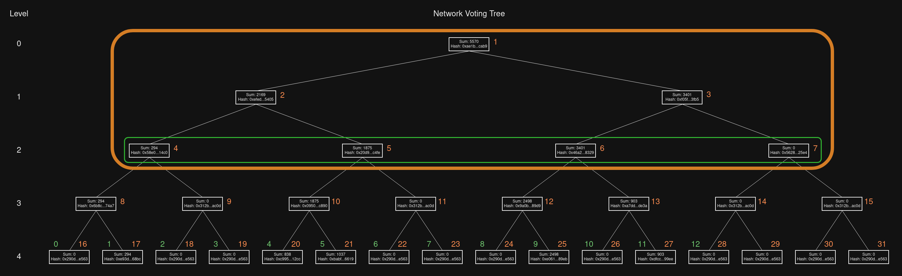

*Figure 5: Pollard used for exemplary proposal consisting of tree nodes 4-7.*
</center>

Thus, the `treeNodes` argument in the proposal will be a four-element array of tree node structs corresponding to tree nodes 4 through 7. Since the left and right child properties of these nodes are not serialized, the only serialized properties to provide in the transaction payload are `sum` and `hash`, where `sum` is a 256-bit unsigned integer. Explicitly, the `treeNodes` argument will consist of the following bytes:

```go
0x0000000000000000000000000000000000000000000000000000000000000126 // Sum of node 4 (294)
0x58e061b04c72870751334701f316b368014cb68cc400a3b95dcdc3f3ec6c14c0 // Hash of node 4
0x0000000000000000000000000000000000000000000000000000000000000753 // Sum of node 5 (1875)
0x20d9b2ddcb52369953a69092d66ec4e8806b13b75bc215dab18b95b217c2c4fe // Hash of node 5
0x0000000000000000000000000000000000000000000000000000000000000d49 // Sum of node 6 (3401)
0x46a2c66663caf1e80cf718e32c803d2051bb65030e1f8c41dda2825076818329 // Hash of node 6
0x0000000000000000000000000000000000000000000000000000000000000000 // Sum of node 7 (0)
0x562870d479b7accb3cbf66f8f01213a0084eaf1d5924421356c64f59982e25e4 // Hash of node 7
```

Upon submission the Rocket Pool smart contracts will use this pollard to calculate the Merkle root of the network voting power tree (which is the same as the hash of the root node in this tree) and store it on-chain, as well as emit an event. This will be used should any challenges to the proposal arise. Note that while the Merkle root is stored on-chain, the Pollard itself is not; this must be retrieved using the event emitted with proposal submission.

The relevant event is called `RootSubmitted` and is emitted by the `rocketDAOProtocolVerifier` contract with the following signature:

```go
struct Node {
   sum uint256;
   hash [32]byte;
}

event RootSubmitted {
   proposalId uint256;
   proposer address;
   blockNumber uint32;
   index uint256;
   root Node;
   treeNodes []Node;
   timestamp uint256;
}
```

where:
- `root` is the root node of the subtree submitted with the event.
  - For proposals this is the root node of the network voting tree at `blockNumber`.
- `treeNodes` is the pollard of the subtree submitted with the event.
  - For proposals this is the pollard of the network voting tree submitted with the proposal.
- `timestamp` is the Unix timestamp, in seconds, of the block that this event was included in.


### Challenge Process

As the complete network voting power tree is not stored on-chain and cannot be calculated within a single transaction due to gas limits, the Protocol DAO proposal system relies on it being generated off-chain but verifiable via Merkle roots that are submitted on-chain. When a user decides to submit a new proposal, they are responsible for constructing the network voting tree at the target block number and ensuring that it is correct.

To *verify* that what they submitted is actually correct (e.g., it has parity with what other independent node operators see and hasn't been tampered with), the protocol relies on **verifiers** to check the details submitted by the proposer. Verifying is an opt-in duty that any Rocket Pool node operator can perform. Their goal is to routinely check the Protocol DAO proposals when a new one has been emitted, construct the corresponding network voting tree for the provided block number, analyze the provided pollard and root to ensure parity with their own tree, and **challenge** the proposal if there is a mismatch anywhere.

When a challenge is issued, an event named `ChallengeSubmitted` is emitted by the `rocketDAOProtocolVerifier` contract:

```go
event ChallengeSubmitted {
   proposalID uint256;
   challenger address;
   index uint256;
   timestamp uint256;
}
```

where:
- `proposalID` is the ID of the proposal the challenge was issued against.
- `index` is the node index of the tree node that had the challenge submitted against it (i.e., the tree node that the challenger believes is not correct).
- `timestamp` is the Unix timestamp, in seconds, of the block that this event was included in.

At a high level, the challenge process works as follows:
1. The proposer submits a proposal with `root` and `treeNodes` for `blockNumber`. This emits a `RootSubmitted` event.
2. A challenger disagrees with the `root` and/or `treeNodes`, and issues a **challenge** to the proposal by indicating a specific **tree node index** of the provided pollard that they disagree on, called `challengedIndex`, along with some other details such as a Merkle proof (discussed later).
   1. `challengedIndex` is called `index` in the `ChallengeSubmitted` event. They are the same thing.
3. The proposer responds by submitting a new subtree: the `root` is now the node at `challengedIndex` and the pollard is the leaf row of that subtree. This emits another `RootSubmitted` event.
   - Challengers can use the `rocketDAOProtocolVerifier.getChallengeState(proposalId, challengedIndex)` function to check if the proposer has responded to the challenge, rather than constantly querying the event logs.
4. The challenger observes this event and finds another node in the new pollard that their tree disagrees with. They submit another **challenge** to the proposal with a new `challengedIndex`, again being an index into the newly submitted pollard.
5. This process continues, gradually descending down the network voting tree, until `challengedIndex` is a *leaf node* of the network voting tree.
6. At this point the proposer must now rely on the node voting tree they created for the node to produce that leaf node.
   1. All of the node indices in this node voting tree must be *virtual indices* relative to the network voting tree, as described in the [Virtual Indices](#virtual-indices) section.
   2. They submit a new response, this time using the `challengedIndex` as the `root` as usual but now the subtree is a subtree of the *node* voting tree rather than the *network* voting tree. Their response includes a pollard from the node voting tree.
7. The challenger and proposer continue traversing down the node voting tree until a leaf node is reached.
8. At this point the contracts can correctly identify the contents of the leaf node because it identifies a corresponding Rocket Pool node. The node's voting power and delegate choices for `blockNumber` are all available on-chain, so the contracts can determine which is accurate: the proposer's view, or the challenger's view.
   1. If the proposer is correct, the challenge is defeated and the proposal lives on. The proposer can claim the challenger's RPL bond as their own.
   2. If the challenger is correct, the proposal is defeated and destroyed. The challenger can claim the proposer's RPL bond as their own.

As part of each challenge round to a proposal, the challenger is required to provide two things:
- A `challengedIndex`, which is the index of a tree node in the pollard that the `RootSubmitted` event provided.
- A `witness`, which is a Merkle summation proof from `challengedIndex` all the way to `root`. Like conventional Merkle proofs, this simply consists of sibling tree nodes along each step of tree traversal. The order must go from bottom to top, and the root node is not included in the witness as the contracts already have it.


## Complete Example

To demonstrate the challenge process in action, we will use the exemplary setup defined above:
- The standard depth-per-round used will be **depth 2**.
- The proposer will issue a proposal using the network voting tree from Figure 2, and the node voting tree for Rocket Pool node 9 from Figure 3 (which includes the correct virtual indices).
- The proposal will be given ID 1.
- There is a challenger that disagrees with the pollard provided by the proposer; they have arrived at a different set of trees with different hashes for the same block number and will issue a set of challenges against the proposal.


### Step 1: Proposal Submission

The first thing that happens is the proposer submits the proposal via `rocketDAOProtocolProposal.propose(...)`, triggering the `RootSubmitted` event with the following values:

```go
rootSubmitted := RootSubmitted {
   proposalId: 1,
   proposer: 0x1234abcd1234abcd1234abcd1234abcd1234abcd,
   blockNumber: 1,
   index: 1,
   root:  Node { // Tree node 1, the root
      sum: 5570,
      hash: 0xae1b4bdfe2aad1a841047fe905ffa36d56a4b6efd1aa93557b1b4adfed97cab9,
   },
   treeNodes: []Node {
      Node { // Tree node 4
         sum: 294,
         hash: 0x58e061b04c72870751334701f316b368014cb68cc400a3b95dcdc3f3ec6c14c0,
      },
      Node { // Tree node 5
         sum: 1875,
         hash: 0x20d9b2ddcb52369953a69092d66ec4e8806b13b75bc215dab18b95b217c2c4fe,
      },
      Node { // Tree node 6
         sum: 3401,
         hash: 0x46a2c66663caf1e80cf718e32c803d2051bb65030e1f8c41dda2825076818329,
      },
      Node { // Tree node 7
         sum: 0,
         hash: 0x562870d479b7accb3cbf66f8f01213a0084eaf1d5924421356c64f59982e25e4
      },
   },
   timestamp: 1699981968,
}
```

Note the `root` and `treeNodes` pollard here correspond to the subtree shown in Figure 5.


### Step 2: Initial Challenge (Round 1)

The challenger keeps track of new proposals and sees the new submission. They see a new proposal with ID 1, collect the `RootSubmitted` event, and regenerate the network voting tree for it using their own Execution client. Upon doing so, they discover a **mismatch** between their Merkle root and the submitted Merkle root. They build their own version of the subtree and compare their pollard values against each node in the pollard submitted with the proposal. They can challenge any node that doesn't match; after all, a single mismatched node will invalidate the proposal.

In this example, we will say that they detect a mismatch against **tree node 6**, which is the third element of the pollard submitted during the proposal. As such, they issue a **challenge** against the proposal, using `6` as the `challengedIndex`. To do so they must first construct the witness. The witness is a Merkle summation proof for the tree node at `challengedIndex` to go from that index to the `root` provided with the proposal; in this case, it consists of tree nodes 7 and 2, as shown below:

<center>

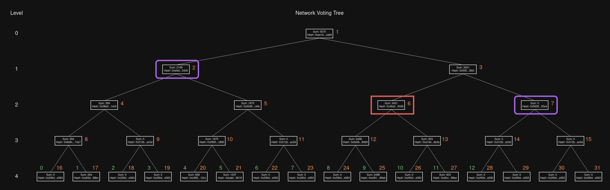

*Figure 6: Challenge issued against `challengedIndex = 6` shown in red. The witness for the challenge is nodes 7 and 2.*
</center>

Thus the challenger will call `rocketDAOProtocolVerifier.createChallenge(proposalID, challengedIndex, challengedTreeNode, witness)` with:
- `proposalID: 1`
- `challengedIndex: 6`
-  ```go
   challengedTreeNode: Node { // Tree node 6
      sum: 3401,
      hash: 0x46a2c66663caf1e80cf718e32c803d2051bb65030e1f8c41dda2825076818329,
   }
   ```
-  ```go
   witness: []Node {
      Node { // Tree node 7
         sum: 0,
         hash: 0x562870d479b7accb3cbf66f8f01213a0084eaf1d5924421356c64f59982e25e4,
      },
      Node { // Tree node 2
         sum: 2169,
         hash: 0xefed2e91176b28e1e40fb6b68706353ad18956d3996a358ffab75f661b7b5405,
      }
   }
   ```

This will trigger the challenge and bond the required amount of RPL from the challenger.


### Step 3: Proposer Response (Round 1)

Upon observing this challenge, the proposer will then respond with a new subtree using the challenged index as the root:

<center>

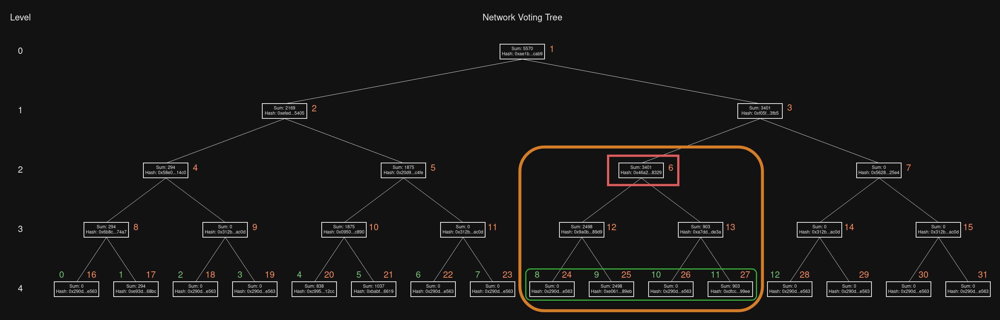

*Figure 7: Subtree and pollard selection for the response to the initial challenge.*
</center>

Here the `root` will be tree node 6 (the `challengedIndex`), and since we are using depth-per-round of 2, the pollard will be the set of leaf nodes 24 through 27.
- **NOTE:** if the depth-per-round would exceed the depth of the tree at this point, it is simply reduced so the pollard will use the leaf nodes.

The proposer will then call the `rocketDAOProtocolVerifier.submitRoot(proposalID, challengedIndex, pollard)` function with:

- `proposalID: 1`
- `challengedIndex: 6`
-  ```go
   pollard: []Node {
      Node { // Tree node 24
         sum: 0,
         hash: 0x290decd9548b62a8d60345a988386fc84ba6bc95484008f6362f93160ef3e563,
      },
      Node { // Tree node 25
         sum: 2498,
         hash: 0xe061f883ffca0dbb2c6cf289bc3f1b06d551f1dc9a41126e43389b1a00db89eb,
      },
      Node { // Tree node 26
         sum: 0,
         hash: 0x290decd9548b62a8d60345a988386fc84ba6bc95484008f6362f93160ef3e563,
      },
      Node { // Tree node 27
         sum: 903,
         hash: 0xdfcc340b8395a869eea6edf345a4e6cdbfe2cbb67abbaa22cb7a33451a3e99ee,
      },
   }
   ```

This will submit a new `RootSubmitted` event where `root` is now the challenged tree node (index 6) and `treeNodes` is the above `pollard`. It will also update the state of the challenge; the challenger can call `rocketDAOProtocolVerifier.getChallengeState(1, 6)` to become aware of the response and proceed to the next step (or they can just monitor and parse the emitted events looking for the appropriate `RootSubmitted` event).


### Step 4: Challenger Response (Round 2)

With the new pollard submitted, the challenger can then continue delving down the tree to highlight the mismatching tree node. In the previous round, the challenger identified **tree node 6** with a mismatch; for the sake of this example, we will now say that their analysis shows **tree node 25** is invalid. Thus, they will follow the same procedure as the previous round, this time using `challengedIndex = 25`:

<center>

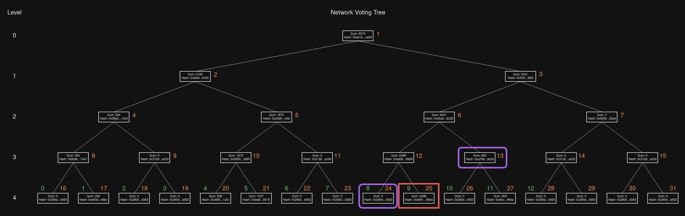

*Figure 8: Challenge issued against `challengedIndex = 25` shown in red. The witness for the challenge is nodes 24 and 13.*
</center>

In this situation the witnesses for the challenge are tree nodes 24 and 13, so the challenger would call `rocketDAOProtocolVerifier.createChallenge(...)` with:
- `proposalID: 1`
- `challengedIndex: 25`
-  ```go
   challengedTreeNode: Node { // Tree node 25
      sum: 2498,
      hash: 0xe061f883ffca0dbb2c6cf289bc3f1b06d551f1dc9a41126e43389b1a00db89eb,
   }
   ```
-  ```go
   witness: []Node {
      Node { // Tree node 24
         sum: 0,
         hash: 0x290decd9548b62a8d60345a988386fc84ba6bc95484008f6362f93160ef3e563,
      },
      Node { // Tree node 13
         sum: 903,
         hash: 0xa7dd48d942dca52ea3e17b0b40b50b1b9a285b50784018c8e83481dc79f1de3a,
      }
   }
   ```

As with before, issuing this challenge will require *another* RPL bond from the challenger. In fact, each challenge will require such a bond until the complete challenge process has been resolved at the end of the proposal.


### Step 5: Proposer Response (Round 2)

The proposer will observe the new challenge and must respond accordingly. This time, the challenge is against a leaf node of the network voting tree. Thus, to continue the process, the proposer must construct a node voting tree for the Rocket Pool node corresponding to the tree node at the challenged index. As indicated previously and using the green numbering included in the diagram, we know that network tree node 25 corresponds to Rocket Pool node 9. Thus, the proposer must construct a node voting tree for Rocket Pool node 9 and must use **virtual indices** for it. A view of that tree is provided in Figure 3.

The proposer must then construct a subtree of this node voting tree (using depth 2, as usual) and respond with the appropriate pollard. In this case it will have virtual indices 100 through 103:

<center>

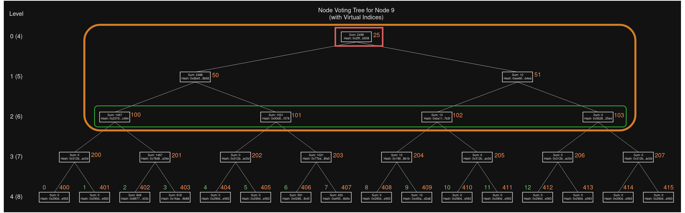

*Figure 9: Subtree and pollard selection for the response against challenged index 25, showing the pollard used from the node voting tree.*
</center>

The proposer then calls `rocketDAOProtocolVerifier.submitRoot(...)` again, this time with:

- `proposalID: 1`
- `challengedIndex: 25`
-  ```go
   pollard: []Node {
      Node { // Tree node 100 (virtual index)
         sum: 1467,
         hash: 0x23765361557e19894939de8c9523d12b080a3489bb7c308cf6ab181b093fc494,
      },
      Node { // Tree node 101 (virtual index)
         sum: 1021,
         hash: 0x93d50e6f206ddf8e4613f28ff2fa6ab3e328355e3c7c96128bcc41791bdff378,
      },
      Node { // Tree node 102 (virtual index)
         sum: 10,
         hash: 0xba110203574c6e4ae97f90acecf42949e8ce6118d01a33fd7dd96c5d3d3f7b3f,
      },
      Node { // Tree node 103 (virtual index)
         sum: 0,
         hash: 0x562870d479b7accb3cbf66f8f01213a0084eaf1d5924421356c64f59982e25e4,
      },
   }
   ```

As with before, a new `RootSubmitted` event is emitted and the state of the challenge is updated accordingly.


### Step 6: Challenger Response (Round 3)

The pattern should be familiar at this point. Now the challenger must create their own view of the node voting tree for Rocket Pool node 9, compare the nodes against the latest provided pollard, and highlight an inconsistency. For the sake of this example, the challenger will flag tree node 100 as the next `challengedIndex`:

<center>

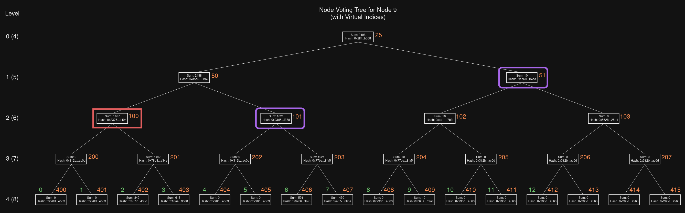

*Figure 10: Challenge against index 100, using 101 and 51 as witnesses.*
</center>

They will also provide a witness with nodes 101 and 51, calling `rocketDAOProtocolVerifier.createChallenge(...)` with:
- `proposalID: 1`
- `challengedIndex: 100`
-  ```go
   challengedTreeNode: Node { // Tree node 100 (virtual index)
      sum: 1467,
      hash: 0x23765361557e19894939de8c9523d12b080a3489bb7c308cf6ab181b093fc494,
   }
   ```
-  ```go
   witness: []Node {
      Node { // Tree node 101 (virtual index)
         sum: 1021,
         hash: 0x93d50e6f206ddf8e4613f28ff2fa6ab3e328355e3c7c96128bcc41791bdff378,
      },
      Node { // Tree node 51 (virtual index)
         sum: 10,
         hash: 0xee60e53d0b0d88bd78411819044df1e87ffd1c233891191509d2f0bb16c1b4ea,
      }
   }
   ```


### Step 7: Endgame

At this point, the proposer must respond by providing a pollard for node 100 using tree nodes 400 through 403:

<center>

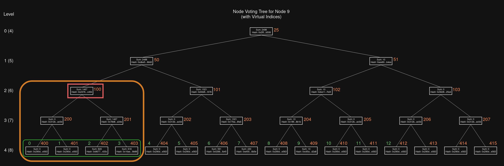

*Figure 11: Subtree and pollard selection for the response against challenged index 100.*
</center>

However, the pollard here is composed of leaf nodes from a node voting tree. Each leaf node is derived from the corresponding Rocket Pool node's local voting power and its delegation assignment. These values are all verifiable on-chain, and the contract will actually perform said verification as part of a call to `rocketDAOProtocolVerifier.submitRoot(...)` (which is what the proposer would call to respond to the challenge).

Thus, in this instance, one of two things could happen:
1. The proposer is wrong; they attempt to call `submitRoot` using their view of the tree, but their view disagrees with the canonical information stored on-chain. The call to the contract will thus revert, and they will not be able to respond to the challenge.
2. The proposer is correct, and the challenger is wrong. The call to `submitRoot` succeeds, and the challenger cannot issue supplemental challenges at a lower level.

How the protocol handles each scenario is discussed below.


### Step 7a: Proposer is Wrong

In this situation, the pollard (and thus the network voting tree) used to submit the original proposal is does not match the canonical data stored within the contracts and the proposal is thus invalid. The RPL bond locked from the proposer as part of the initial proposal is forfeit. It will be awarded to the challenger.

Since the proposer cannot respond to the challenge, the challenge window on the proposal will eventually expire (determined by the `proposal.challenge.period` setting in the `rocketDAOProtocolSettingsProposals` contract) with a remaining challenge still in place. Once it does, the challenger can call `rocketDAOProtocolVerifier.defeatProposal(proposalID, challengedIndex)` using the last challenged index (here `challengedIndex=100`) to end the proposal.

Once the proposal has been defeated, the challenger can reclaim all of their originally bonded RPL and collect the proposer's RPL bond using the `rocketDAOProtocolVerifier.claimBondChallenger(proposalID, indices)` function where `indices` is an array of unsigned 256-bit integers, each of which is a tree node index that the challenger created a challenge against (in this case, it would be `6`, `25`, and `100`).

*NOTE: to clarify, the proposer's bond will be split among all of the challengers that contributed to the proposal's defeat, should more than one challenger successfully challenge an node tree index.*


### Step 7b: Challenger is Wrong

In this situation, the pollard used to submit the original proposal matches what is on-chain and thus the new pollard in response to this latest challenge can be verified by the contracts. The proposer can proceed with submitting the new pollard via a typical call to `rocketDAOProtocolVerifier.submitRoot(...)`, this time with:

- `proposalID: 1`
- `challengedIndex: 100`
-  ```go
   pollard: []Node {
      Node { // Tree node 400 (virtual index)
         sum: 0,
         hash: 0x290decd9548b62a8d60345a988386fc84ba6bc95484008f6362f93160ef3e563,
      },
      Node { // Tree node 401 (virtual index)
         sum: 0,
         hash: 0x290decd9548b62a8d60345a988386fc84ba6bc95484008f6362f93160ef3e563,
      },
      Node { // Tree node 402 (virtual index)
         sum: 849,
         hash: 0x8677245efe7b4c837a68d174ccf192b776ac016321e47ae441b1bcb493c7433c,
      },
      Node { // Tree node 403 (virtual index)
         sum: 618,
         hash: 0x16ae9e47fbde243f99872b883e60e4518c3a1d1b48b5800fe44678ea3fa49b88,
      },
   }
   ```

As with before, a new `RootSubmitted` event is emitted and the state of the challenge is updated accordingly.

This time, since the pollard corresponds to leaf nodes of the node voting tree (which are all verifiable on-chain), there is nothing left to challenge. The fact that this call to `submitRoot` succeeded indicates that the pollard provided with the proposal is legitimate (or at least, the pollard provided in responde to the previous challenged index was legitimate) so the challenge fails.

Once the proposal has successfully ended, the proposer can reclaim their original proposal bond and collect challenge bonds provided by challengers by using the `rocketDAOProtocolVerifier.claimBondProposer(proposalID, indices)` function where `indices` is an array of unsigned 256-bit integers, each of which is a tree node index that was challenged and successfully responded to (in this case, it would be `6`, `25`, and `100`).
