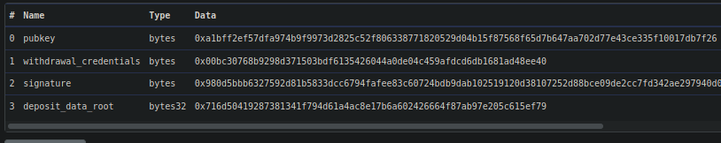
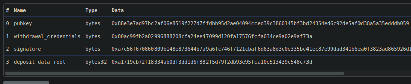
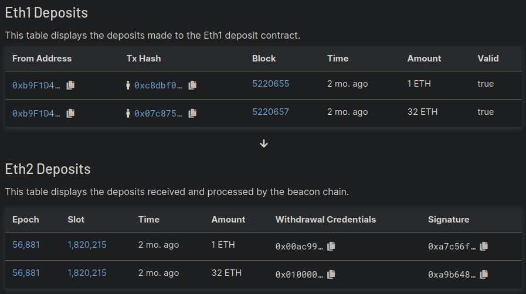

# Analysis and Mitigation of the Withdrawal Credential Exploit

On October 4th 2021 at approximately 11 PM UTC, Rocket Pool was notified through its [Bug Bounty program](https://immunefi.com/bounty/rocketpool/) of an advanced exploit that could be used to attack staking pools, both centralized and decentralized. 
The issue was reported by whitehat Dmitri Tsumak (who was using an anonymous handle at the time).

Within an hour of discussing the exploit, the Rocket Pool team confirmed both its validity and severity.
We promptly notified our community that we would be [postponing our launch](https://discord.com/channels/405159462932971535/405163979141545995/894769328858226728) while we studied the exploit and determined a proper mitigation strategy for it.
We also began reporting this to the Ethereum staking community at large through our Immunefi partners.

In this report, we will describe the exploit, our analysis, our mitigation strategy, and future plans.

## Background

The exploit revolves around the way ETH deposits are processed by the Beacon Chain in order to add new validators.
To fully describe it, we will provide some background context first.

A "normal" Beacon Chain validator is made of two things:
- A **validator key pair**, used for validation duties such as signing attestations and proposing blocks
- A **withdrawal key pair**, used for withdrawing ETH from the validator

Both of these key pairs consist of a **public key** and a **private key**.

Traditionally, when you want to make a new Beacon Chain validator, you send a transaction to the [Beacon Chain Deposit Contract](https://etherscan.io/address/0x00000000219ab540356cbb839cbe05303d7705fa).
The transaction must provide the following parameters:

1. The **public key** of the validator key that you intend to use (this is the address you use on explorers such as [https://beaconcha.in/](https://beaconcha.in/) to monitor your validator)
2. The hash of the **withdrawal public key**, which is traditionally prefixed with the byte `0x00`
3. Some **signature data** that contains the above information and is signed with the **validator private key** to confirm that the sender actually owns the key

You can see an example of such a deposit [here](https://etherscan.io/tx/0xcc6ee0dde8370170d4c94fd335f966a837f62ab3a98ef8334d5c026753af33b3):

The Beacon Chain clients will periodically review all of the deposits to this contract, and when a sufficient number of blocks have gone by for safety, they will vote to add those deposits as new validators.

In order to actually *begin* validation on the Beacon Chain, a validator must have deposited **at least 32 ETH** into the deposit contract.
Traditionally this isn't an issue; users will simply submit a single transaction with all of the above information and include 32 ETH in the transaction, thus handling all of the necessary criteria at once.

However, the deposit contract spec does not explicitly state that this single transaction is required.
In fact, you can break your deposit up into multiple transactions if you so choose - the only requirement is that at least 1 ETH be attached per transaction.
At the end of the day, as long as all of the deposits with a given validator public key are both signed properly and add up to at least 32 ETH, the Beacon Chain will acknowledge and activate that validator.

This is where the exploit comes into play.

## The Exploit

Though the Beacon Chain permits multiple deposits for a single validator public key, it **does not verify that all of them also have the same withdrawal credentials**.
Instead, it will use the withdrawal credentials presented in the **first valid deposit** and make them the canonical withdrawal credentials for that validator, regardless of what subsequent deposits specify.

This enables a malicious user **with access to the validator private key** to essentially specify whatever withdrawal credentials they want for the validator.

Here is an example of the exploit in the wild on an Ethereum test network.
In the following, the validator's public key is `0x88e3e7ad97bc2af06e8519f227d7ffdbb95d2ae04094cced39c3860145bf3bd24354ed6c92de5af0d38a5a35edddb059`.

In the [first transaction](https://goerli.etherscan.io/tx/0xc8dbf0b3258c396033c3e7ac8ed242bac3dfc63d528ff449ea93f9d1c28b6644) to the deposit contract, with only 1 ETH, the withdrawal credentials are set to `0x00ac99fb2a02996888208cfa24ee47099d120fa17576fcfa034ce9a02e9af73a`:

This is quickly followed by a [second transaction](https://goerli.etherscan.io/tx/0x07c8755dce41b4304c8bba14e4a1ab3a665a08356bb8638410b2abc83fff4360) to the deposit contract using the **same validator pubkey** but **different withdrawal credentials** of `0x0100000000000000000000002296e122c1a20fca3cac3371357bdad3be0df079`:

This can be verified using the [validator's page on the Pyrmont beaconcha.in explorer](https://pyrmont.beaconcha.in/validator/0x88e3e7ad97bc2af06e8519f227d7ffdbb95d2ae04094cced39c3860145bf3bd24354ed6c92de5af0d38a5a35edddb059#deposits):

When querying a Beacon Node what the withdrawal credentials for this validator are, it will respond with `0x00ac99fb2a02996888208cfa24ee47099d120fa17576fcfa034ce9a02e9af73a` since those were the credentials seen in the first valid deposit.

Generally, the validator key owner and withdrawal key owner are the same person and thus they would have no reason to exploit this behavior.
It only becomes a problem when the validator key owner is **not** the withdrawal key owner, and thus the validator key owner can set the withdrawal credentials to something **other than what the withdrawal key owner intended**, effectively nullifying the power of their withdrawal key.

Ethereum researcher Jim McDonald actually [described this very exploit](https://ethresear.ch/t/deposit-contract-exploit/6528) in a research post several years ago and [submitted a pull request](https://github.com/ethereum/consensus-specs/pull/1506) to the Beacon Chain's specifications, but it was not accepted.

## Application to Rocket Pool

Rocket Pool minipools operate *slightly* differently than normal validators.
They still use a validator key pair, but they **do not have a withdrawal key pair**.
Instead, they rely on an extension known as [Eth1 withdrawal credentials (also known as "0x01")](https://github.com/ethereum/consensus-specs/pull/2149).

In `0x01` mode, the withdrawal credential field is prefixed with `0x01` instead of `0x00` as described earlier.
The value of this field is no longer the hash of the withdrawal public key, but is actually **an address on the Ethereum execution layer (formerly Eth 1.0)**.
This can be the address of a wallet or a smart contract.

Instead of using a withdrawal key to sign and submit a withdrawal message, when a `0x01` validator receives a message to exit a validator from the Beacon Chain, it will send all of that validator's balance to the specified address on the execution layer.

When a Rocket Pool node operator uses the CLI to perform a `node deposit` command, they are actually doing the following:

- Creating a new validator key pair
- Creating a new contract on the execution layer (this is the minipool that "owns" the validator)
- Transferring 16 ETH to the minipool
- Joining Rocket Pool's queue to receive 16 additional ETH from the staking pool

Note that this may create the minipool, but it **does not** trigger a transaction to the Beacon Chain Deposit Contract yet.
However, at this point, the node operator owns the validator public key and private key that the minipool will use.

Once the minipool has been created, the `rocketpool_node` process will wait until its turn in the queue.
When its turn arrives, it performs the following:

1. Construct all of the Beacon Chain deposit information, setting the withdrawal credentials in the deposit to the address of the minipool (prefixed by `0x01`)
1. Use the validator's private key to sign all of this information
1. Call `stake` on the minipool, which will:
    1. Validate that the withdrawal credentials are correctly set to the address of the minipool.
    1. Collect 16 ETH from the staking pool and merge it with the 16 ETH of the node operator.
    1. Submit the deposit information and combined 32 ETH to the Beacon Chain deposit contract.

The exploit takes advantage of the fact that the node operator can generate the validator key pair well in advance, before the deposit has been sent from the minipool to the deposit contract.
In this window, the node operator can use the validator private key to **create a malicious deposit** with different withdrawal credentials and front run the `stake` transaction.
The minipool can only validate that its deposit payload is correct; it cannot check the deposit contract to see if a deposit has already been submitted using the same validator public key, because that information is not available to it.

The result of this exploit is that the node operator is now in **complete control** of the entire validator balance on the Beacon Chain, including the 16 ETH from the staking pool and all of the rewards.

In the example of the exploit above, the "intended" credentials (the ones from the second 32 ETH deposit) were likely for [such a smart contract address](https://etherscan.io/address/0x2296e122c1a20fca3cac3371357bdad3be0df079), but were front-run with a conventional `0x00`-based withdrawal key hash.
Thus, the node operator would be able to withdraw the funds to their own address at any time, bypassing whatever security measures had been built into the target smart contract entirely.

## Our Mitigation

The point that the minipool cannot see previous deposits and verify they have the same withdrawal credentials is the issue at heart.
Thus, the minipool needs an outside source of information that *can* verify this fact prior to acquiring funds from the staking pool.

Rocket Pool already has such a construct: the Oracle DAO, which is responsible for shuttling information from the Beacon Chain to the execution layer's smart contracts.
In this case, the information is a natural extension to the Oracle DAO's existing reporting duties: the withdrawal address of a validator exists on the Beacon Chain and is the source of this problem in the first place.

Rocket Pool's mitigation strategy for this exploit is thus quite simple, and only requires a small amount of modification.
The new `node deposit` workflow will work as follows:

1. The node operator calls `node deposit` using the CLI.
2. The Smartnode creates a new validator key pair, and uses the [`CreateAddress2()`](https://pkg.go.dev/github.com/ethereum/go-ethereum/crypto#CreateAddress2) function to deterministically derive the new minipool contract's address before it is even deployed.
3. The Smartnode assembles a deposit payload, including the validator public key, the minipool's address for the withdrawal credentials, and the signature.
4. The Smartnode calls `deposit` on the smart contracts with this payload information.
5. The smart contracts create the minipool contract at the predetermined address and send a deposit to the Beacon Chain deposit contract, which contains all 16 ETH of the node operator's deposited funds. The minipool is now in `prelaunch` status. 
6. The Oracle DAO verifies, both by looking at the Beacon Chain itself and at the deposit contract, that the validator public key was **not** used by this front-running exploit, and thus the first ever valid deposit **correctly has the minipool's address in the withdrawal credentials**. If it fails this test, the Oracle DAO votes to **scrub the minipool**, dissolving it and locking the user's deposited funds on the Beacon Chain while leaving the staking pool's capital unharmed.
7. After a certain safety period to enable the Oracle DAO to do this verification, if the minipool has not been scrubbed, it can proceed to launch.
8. The `rocketpool_node` process calls `stake` on the minipool, which deposits an additional 16 ETH from the staking pool to the validator's public key and launches the validator.

At this point, an attacker will have to expend 16 ETH of their own funds to try to leverage this exploit.
This makes it prohibitively expensive to use as an attack vector, and because any attempts to do so are immediately and publicly visible on the execution chain, such an attack will always be trivial to mitigate with this new process in place.

## Considerations

### Permissionlessness
This plan retains the core ethos of **Rocket Pool's permissionless nature** while still **safeguarding the staking pool's funds**.
As everything involved in this process can be seen publicly on both chains, any deviation (e.g. scrubbing a minipool that had valid a deposit) would be immediately observable by everyone and action could be taken appropriately.

### Non-Destructive Nature
This plan **does not burn any funds** in the event of a false-positive.
Funds may be locked on the Beacon Chain, but subsequent deposits could be used to turn them into a fully functioning validator; the only thing lost is opportunity cost while funding is locked.

### Impact on Node Operators
This plan **minimally impacts node operator wait time**.
By checking against both the Beacon Chain and the deposit contract, the Oracle DAO can quickly find any instances of malicious deposits without needing to wait for deposits to be accepted by the Beacon Chain (which can take upwards of 24 hours).

### Impact on Oracle Duties
This plan **only requires Oracle transactions in the case of detection**; normal minipool staking is not affected by this process and does not depend on the Oracle DAO's blessing.
The Oracle DAO will **not** have to adjust the RPL reward distribution to offset additional gas costs, and instead will simply add these costs to their existing structure.
That being said, we believe the very presence of this mechanism will dissuade any attempts to perform the exploit, and thus no additional gas expenditure is expected for the Oracle nodes.

### Vanity Minipool Addresses
Finally, this plan has one interesting advantage: node operators can now select their seed value for the `CreateAddress2()` function, which means they can create **[vanity addresses](https://vanity-eth.tk/)** for their minipools if they so desire.
We will include a feature for searching through seeds to find a vanity minipool address in the Smartnode CLI in a future update.

### Reliance on Window of Safety 

The mode of signaling a malicious deposit, rather than signaling a valid one, means that the default mode (when the Oracle DAO cannot come to consensus) is to allow deposits through even if they are malicious.
This puts the burden on the Oracle DAO to stay in consensus at all times.
As this is already expected of the Oracle DAO for stable operation of the protocol, we do not consider this to be a blocking requirement.

## Our Plan

At the time of this report, we are actively implementing this solution into our Smartnode stack and smart contracts.

When they are complete, we will have the modifications thoroughly audited by **Sigma Prime** - one of the respected auditing firms that [initially audited our smart contracts](https://rocketpool.net/files/SigmaPrimeAudit.pdf).
The original whitehat, Dmitri Tsumak, who discovered the original exploit and **collected our $100,000 maximum bounty for reporting it**, has also agreed to test the solution once it is in place.

This review and audit is currently scheduled to begin on **October 18th**.
While this plan is underway, we will be reaching out to other security professionals and our community to solicit feedback and additional scrutiny on this exploit, our solution, and Rocket Pool at large.

## Acknowledgements

We want to thank Dmitri Tsumak for reporting this exploit to us prior to our launch and preventing the potential loss of user funds.
We also want to acknowledge Rocket Pool community members Joao Poupino (@poupas), Ken (@htimsk), @isidorosp, and Thorsten Behrens (@yorickdowne), and all of the others who managed to discover and research this issue on their own - their open conversations were quite helpful in validating our own insight into the exploit before we could publish it.