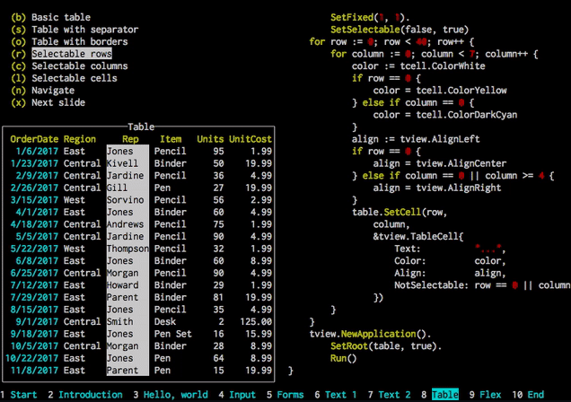
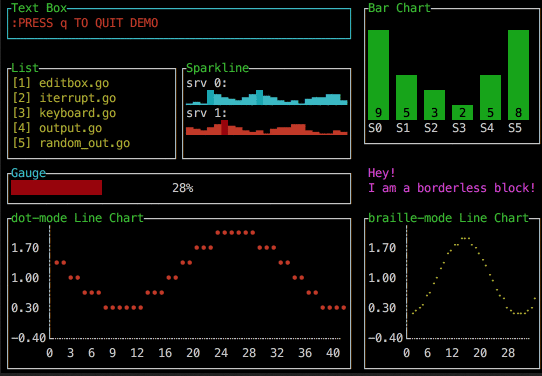
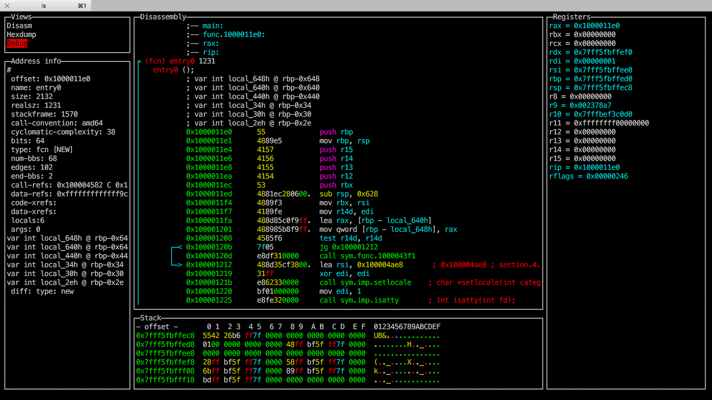

# Smartnode Candidate Architectures for `service config`

This file describes the candidate architectures for the user interface for the `service config` function.
It will provide information about the various settings to the user, allow them to submit values for those settings, and serialize everything upon saving so that `docker-compose` can correctly work with the containers the user requests.


## UI1

This will use a simple text-based interface that provides the user with a list of options / actions, each associated with a number, then the user inputs the number of the option / action they want to interact with.
It's analogous to those old-school text-based adventures.
Something like this:

```
Select setting category:
1. Smartnode settings
2. Transaction fee settings
3. ETH1 client settings
4. ETH1 fallback settings
5. ETH2 client settings

> 
```

It's a constant back-and-forth with user-issued inquiries or commands and responses from the system that clear the console and produce some output based on them.


## UI2

This will use a Terminal UI (TUI) to generate a rich user interface with various controls and colors while still residing within an SSH session.
The following are several examples from popular TUI libraries that support Go:

<center>

[tview](https://github.com/rivo/tview)



---

[termui](https://github.com/gizak/termui)



---

[gocui](https://github.com/jroimartin/gocui)



</center>

The intent is to give the user an easily navigable structure of settings with a description of each one, some way to describe the valid values, and as much assistance as possible in filling them out.


## UI3

With this option, we move the mechanics of `service config` from the CLI into the Daemon, and set up a set of API routes that can take in some kind of standard input and write out the requisite configuration files.
This means tools like a GUI or WebUI on a different machine could configure the Smartnode instead of having the Smartnode itself do it over SSH.
